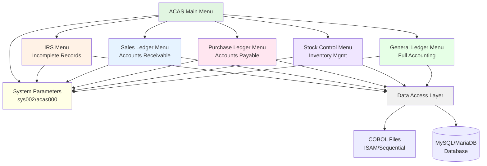
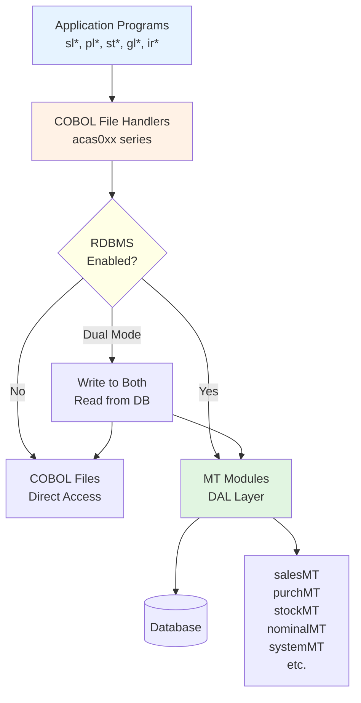
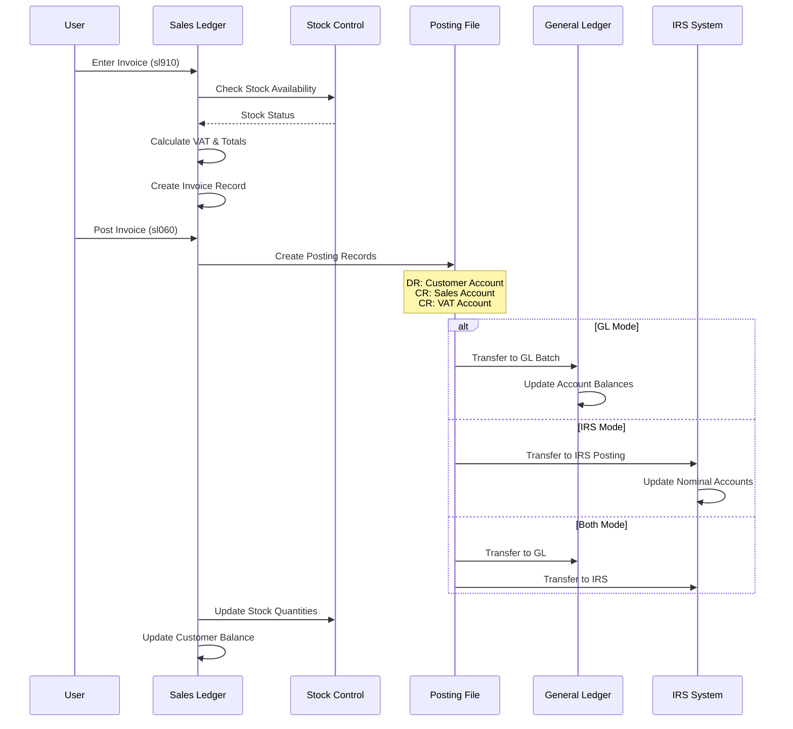
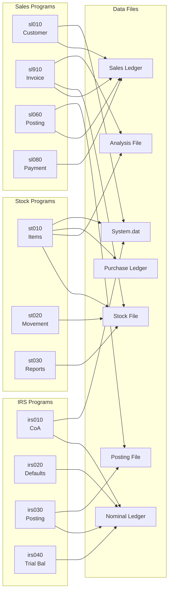
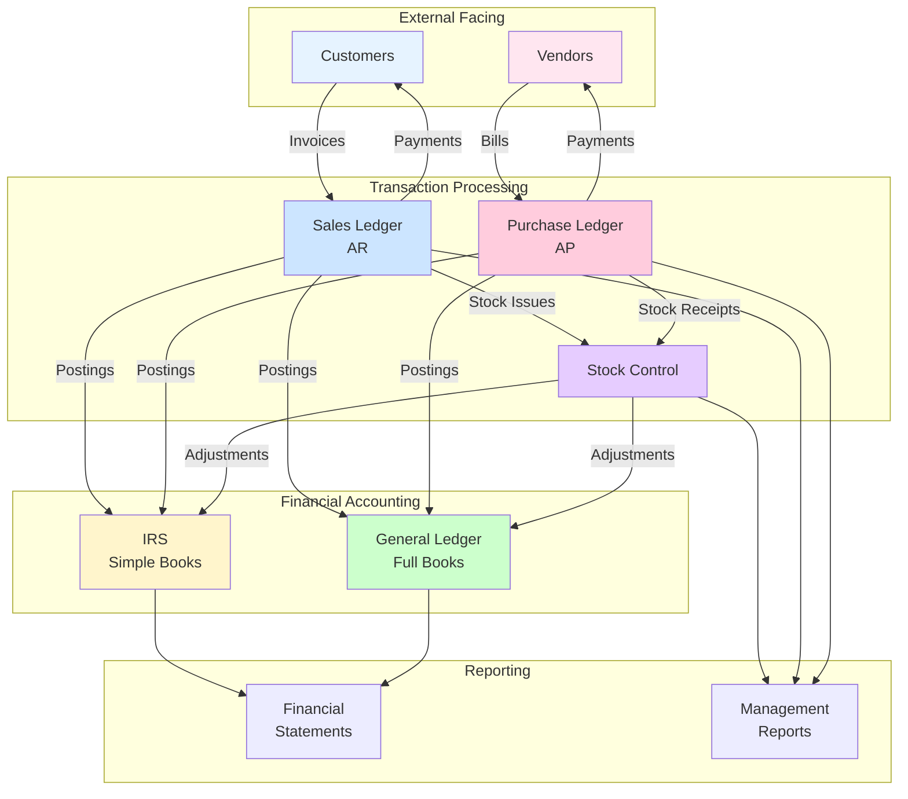
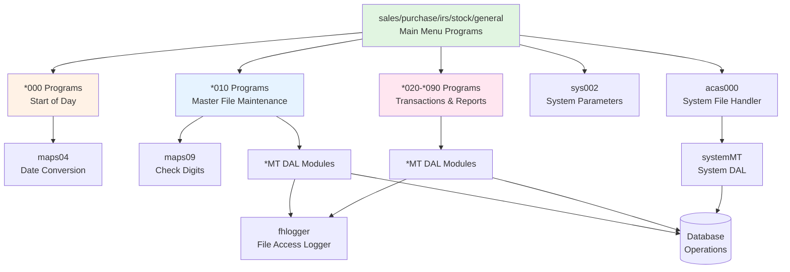
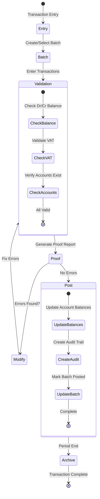
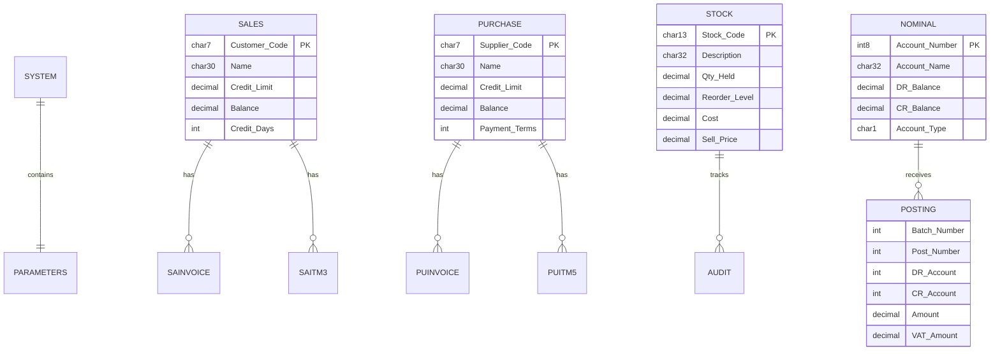

# ACAS System Architecture Diagrams

## 1. System Overview - Module Architecture

## 2. Data Access Layer (DAL) Architecture

## 3. Transaction Flow - Sales to GL/IRS

## 4. File Access Matrix

## 5. Accounting Module Interactions

## 6. Program Call Hierarchy

## 7. Batch Processing Flow

## 8. Database Schema Overview

These diagrams provide a comprehensive view of the ACAS system architecture, showing:
1. The modular structure with five main subsystems
2. The flexible DAL architecture supporting both files and databases
3. Transaction flows from source documents to financial records
4. File access patterns showing which programs access which data
5. Integration between accounting modules
6. Program call hierarchies
7. Batch processing workflows
8. Key database relationships

The system demonstrates a well-structured accounting solution with clear separation of concerns and flexible deployment options.