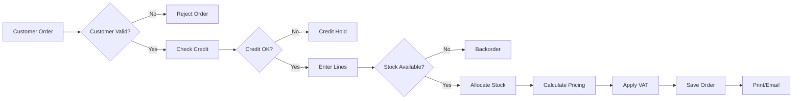
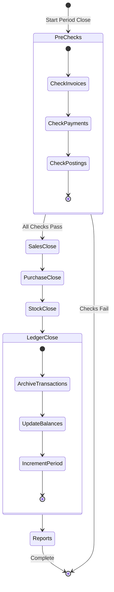
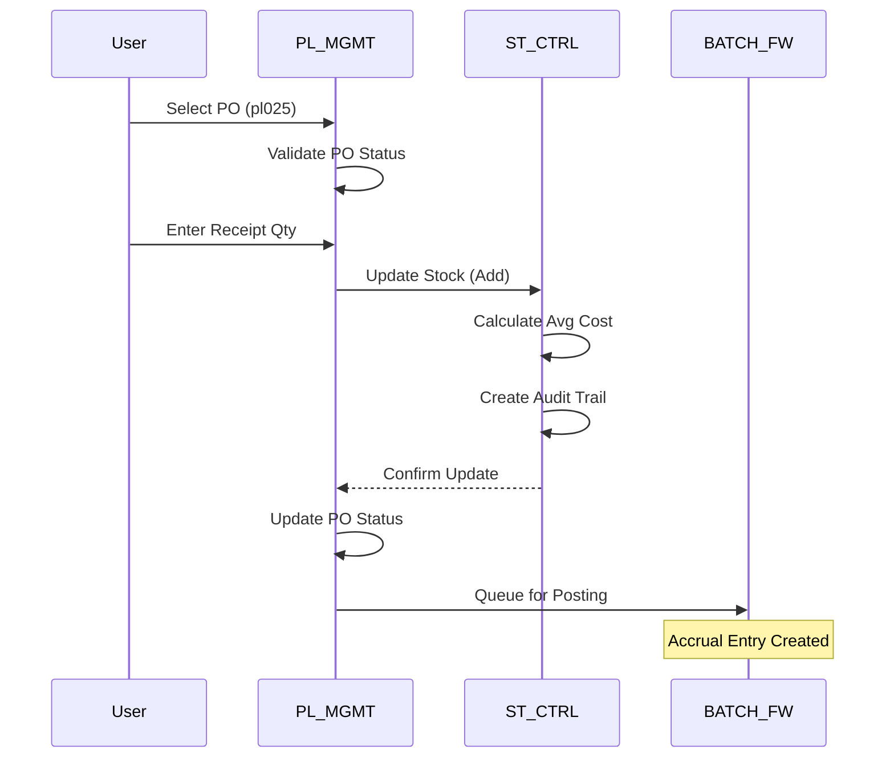
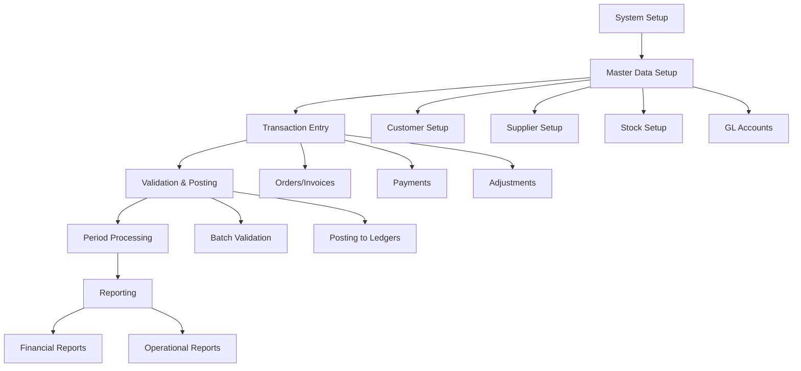

# ACAS Business Process Allocation

## Overview

This document maps business processes to their executing subsystems, showing how end-to-end business workflows traverse subsystem boundaries. Understanding process allocation is critical for modernization efforts as it reveals natural transaction boundaries and integration requirements.

## Business Process Inventory

### Financial Processes

| Process ID | Process Name | Primary Subsystem | Supporting Subsystems | Frequency |
|------------|--------------|-------------------|----------------------|-----------|
| FIN-001 | Journal Entry Processing | GL_CORE/IRS_CORE | BATCH_FW | Daily |
| FIN-002 | Financial Statement Generation | GL_CORE/IRS_CORE | RPT_ENGINE | Monthly |
| FIN-003 | Trial Balance Production | GL_CORE/IRS_CORE | RPT_ENGINE | On-demand |
| FIN-004 | Period-End Closing | PERIOD_PROC | All | Monthly |
| FIN-005 | Year-End Processing | PERIOD_PROC | All | Annual |
| FIN-006 | VAT Return Preparation | GL_CORE/IRS_CORE | SL_MGMT, PL_MGMT | Quarterly |

### Sales Processes

| Process ID | Process Name | Primary Subsystem | Supporting Subsystems | Frequency |
|------------|--------------|-------------------|----------------------|-----------|
| SAL-001 | Customer Onboarding | SL_MGMT | SYS_ADMIN | As needed |
| SAL-002 | Sales Order Entry | SL_MGMT | ST_CTRL | Daily |
| SAL-003 | Invoice Generation | SL_MGMT | ST_CTRL, RPT_ENGINE | Daily |
| SAL-004 | Payment Receipt | SL_MGMT | BATCH_FW | Daily |
| SAL-005 | Credit Control | SL_MGMT | RPT_ENGINE | Weekly |
| SAL-006 | Customer Statements | SL_MGMT | RPT_ENGINE | Monthly |
| SAL-007 | Aged Debtors Analysis | SL_MGMT | RPT_ENGINE | Weekly |
| SAL-008 | Standing Order Processing | SL_MGMT | BATCH_FW | Monthly |

### Purchase Processes

| Process ID | Process Name | Primary Subsystem | Supporting Subsystems | Frequency |
|------------|--------------|-------------------|----------------------|-----------|
| PUR-001 | Supplier Onboarding | PL_MGMT | SYS_ADMIN | As needed |
| PUR-002 | Purchase Order Creation | PL_MGMT | ST_CTRL | Daily |
| PUR-003 | Goods Receipt | PL_MGMT | ST_CTRL | Daily |
| PUR-004 | Invoice Matching | PL_MGMT | - | Daily |
| PUR-005 | Payment Selection | PL_MGMT | - | Weekly |
| PUR-006 | Cheque Run | PL_MGMT | RPT_ENGINE | Weekly |
| PUR-007 | Aged Creditors Analysis | PL_MGMT | RPT_ENGINE | Weekly |

### Inventory Processes

| Process ID | Process Name | Primary Subsystem | Supporting Subsystems | Frequency |
|------------|--------------|-------------------|----------------------|-----------|
| INV-001 | Stock Item Setup | ST_CTRL | PL_MGMT | As needed |
| INV-002 | Stock Receipt | ST_CTRL | PL_MGMT | Daily |
| INV-003 | Stock Issue | ST_CTRL | SL_MGMT | Daily |
| INV-004 | Stock Adjustment | ST_CTRL | BATCH_FW | As needed |
| INV-005 | Reorder Processing | ST_CTRL | PL_MGMT | Daily |
| INV-006 | Stock Valuation | ST_CTRL | RPT_ENGINE | Monthly |
| INV-007 | Stock Take | ST_CTRL | RPT_ENGINE | Quarterly |

## Detailed Process Flows

### SAL-002: Sales Order Entry Process

**Primary Owner**: SL_MGMT  
**Business Purpose**: Create and validate customer orders with inventory allocation

**Subsystem Interactions**:
1. SL_MGMT validates customer (local data)
2. SL_MGMT checks credit limit (local data)
3. ST_CTRL validates stock availability (cross-subsystem call)
4. SL_MGMT calculates pricing with SYS_ADMIN VAT rates
5. ST_CTRL updates allocated quantities

### FIN-004: Period-End Closing Process

**Primary Owner**: PERIOD_PROC  
**Business Purpose**: Close accounting period and roll forward balances

**Subsystem Coordination**:
- PERIOD_PROC orchestrates sequential closing
- Each subsystem performs local closing tasks
- System-wide period update only after all complete

### PUR-003: Goods Receipt Process

**Primary Owner**: PL_MGMT  
**Business Purpose**: Receive goods and update inventory

## Process Characteristics

### Transaction Boundaries

| Process | Transaction Scope | Rollback Capability | Consistency Model |
|---------|------------------|---------------------|-------------------|
| Invoice Posting | Single invoice + stock | Manual only | Eventually consistent |
| Payment Allocation | Payment + invoices | Manual only | Immediate |
| Period Close | Entire period | None | Batch consistent |
| Stock Movement | Single movement | Manual only | Immediate |
| Batch Posting | Entire batch | Reject batch | All or nothing |

### Process Dependencies

## Process Performance Metrics

### Expected Processing Times

| Process | Volume | Expected Time | Subsystems Involved |
|---------|--------|---------------|---------------------|
| Invoice Entry | Per invoice | 2-5 minutes | SL_MGMT, ST_CTRL |
| Invoice Posting | 100 invoices | 5 minutes | SL_MGMT, BATCH_FW |
| Payment Run | 50 suppliers | 15 minutes | PL_MGMT |
| Month-End | Full close | 2 hours | ALL |
| Trial Balance | Full report | 30 seconds | GL/IRS_CORE |
| Stock Valuation | 1000 items | 2 minutes | ST_CTRL |

### Process Bottlenecks

| Process | Bottleneck | Impact | Mitigation |
|---------|------------|--------|------------|
| Period Close | Sequential processing | 2+ hour window | Parallelize where possible |
| Batch Posting | Single-threaded | Delays in GL update | Queue management |
| Report Generation | File I/O | Slow reports | Consider caching |
| Stock Updates | Lock contention | Transaction delays | Optimize locking |

## Business Rules by Process

### Sales Order Processing Rules

| Rule | Implementation | Subsystem |
|------|----------------|-----------|
| Credit limit check | On order entry | SL_MGMT |
| Minimum order value | On order save | SL_MGMT |
| Stock allocation | Real-time | ST_CTRL |
| Pricing hierarchy | On line entry | SL_MGMT |
| VAT calculation | Automatic | SL_MGMT |
| Discount approval | By limit | SL_MGMT |

### Period Closing Rules

| Rule | Implementation | Subsystem |
|------|----------------|-----------|
| All invoices posted | Pre-check | SL_MGMT |
| All payments allocated | Pre-check | SL/PL_MGMT |
| Stock movements complete | Pre-check | ST_CTRL |
| Backup required | Warning | PERIOD_PROC |
| No future dating | Validation | ALL |

## Process Modernization Opportunities

### Candidates for Automation

| Process | Current State | Automation Opportunity | Priority |
|---------|--------------|------------------------|----------|
| Standing Orders | Manual trigger | Scheduled jobs | High |
| Payment Matching | Manual allocation | Auto-match rules | High |
| Reorder Processing | Manual review | Automated POs | Medium |
| Report Distribution | Print/manual email | Auto email/portal | Medium |
| Period Close | Manual steps | Orchestrated workflow | Low |

### Process Optimization

| Process | Current Issue | Proposed Solution |
|---------|--------------|------------------|
| Invoice Entry | Sequential processing | Bulk import API |
| Payment Processing | Batch only | Real-time options |
| Stock Updates | Synchronous | Event-driven async |
| Report Generation | On-demand only | Scheduled/cached |

## Process Governance

### Process Ownership

| Process Category | Business Owner | IT Owner | Change Authority |
|-----------------|----------------|----------|------------------|
| Financial | CFO/Controller | GL Team | Finance Committee |
| Sales | Sales Manager | AR Team | Sales Committee |
| Purchasing | Purchase Manager | AP Team | Purchase Committee |
| Inventory | Warehouse Manager | Stock Team | Operations Committee |

### Process Change Control

1. **Impact Analysis Required For**:
   - Cross-subsystem process changes
   - Transaction flow modifications
   - Business rule changes
   - Integration point changes

2. **Testing Requirements**:
   - Unit testing within subsystem
   - Integration testing across subsystems
   - End-to-end process testing
   - Performance testing for batch processes

3. **Documentation Updates**:
   - Process flow diagrams
   - Business rule documentation
   - User procedures
   - Integration specifications

## Cross-Subsystem Process Matrix

| From/To | GL_CORE | IRS_CORE | SL_MGMT | PL_MGMT | ST_CTRL |
|---------|---------|----------|---------|---------|---------|
| GL_CORE | - | Exclusive | Read postings | Read postings | Read postings |
| IRS_CORE | Exclusive | - | Read postings | Read postings | Read postings |
| SL_MGMT | Write postings | Write postings | - | None | Update stock |
| PL_MGMT | Write postings | Write postings | None | - | Update stock |
| ST_CTRL | Write adjustments | Write adjustments | Read for avail. | Read suppliers | - |

**Legend**:
- Exclusive: Cannot both be active
- Write: Creates/updates data
- Read: Queries data only
- Update: Modifies specific fields

---

Document Version: 1.0  
Analysis Date: December 2024