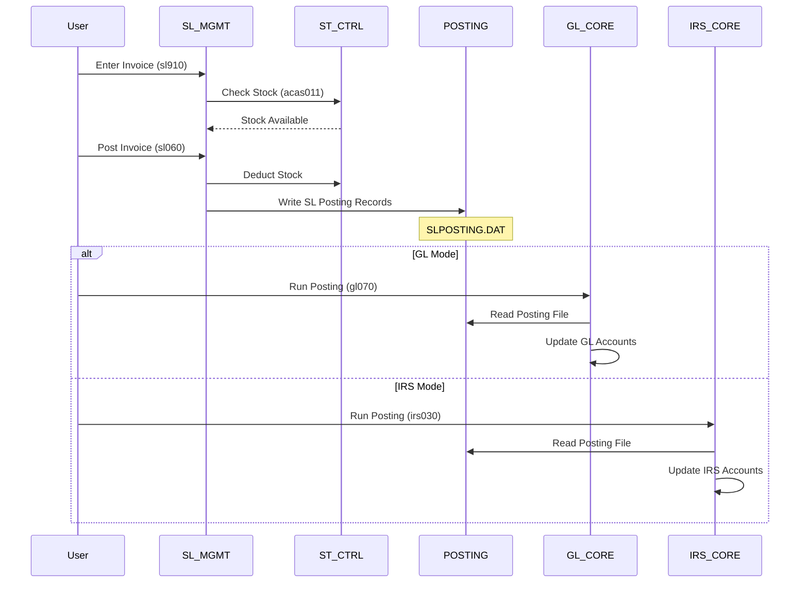
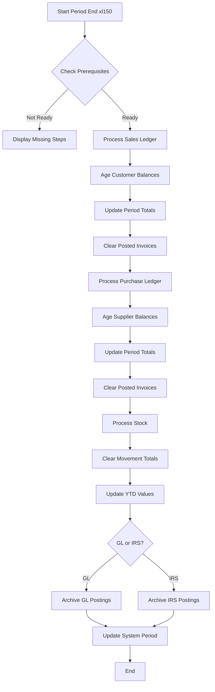

# ACAS Integration Architecture

## Overview

This document defines the integration patterns, interfaces, and data flows between ACAS subsystems. The integration architecture is primarily file-based with batch processing patterns, reflecting the system's COBOL heritage while supporting both traditional file access and modern RDBMS operations.

## Integration Patterns

### 1. File-Based Integration
- **Pattern**: Source subsystem writes to intermediate file, target subsystem reads
- **Usage**: Posting from SL/PL to GL/IRS
- **Frequency**: Daily batch processing
- **Example**: SLPOSTING file created by Sales, consumed by GL/IRS

### 2. Direct Database/File Access
- **Pattern**: Subsystem directly reads/updates another's data
- **Usage**: Stock updates from Sales/Purchase
- **Frequency**: Real-time during transaction
- **Example**: Invoice posting directly decrements stock quantities

### 3. Shared Master Data
- **Pattern**: Multiple subsystems read common configuration
- **Usage**: System parameters, analysis codes
- **Frequency**: On-demand read access
- **Example**: All modules read SYSTEM.DAT for configuration

### 4. Parameter Passing
- **Pattern**: Menu program passes context via COBOL linkage
- **Usage**: Navigation between modules
- **Frequency**: User-initiated
- **Example**: ACAS menu calling Sales with user context

## Subsystem Interface Contracts

### GL_CORE ← SL_MGMT Interface

**Interface ID**: INT_SL_GL_001  
**Type**: File Transfer (Posting File)  
**Direction**: SL_MGMT → GL_CORE  

**Data Contract**:
```cobol
01  SL-POSTING-RECORD.
    03  POST-CODE        PIC XX.        -- Transaction type (SI, SC, SR)
    03  POST-DATE        PIC 9(8).      -- YYYYMMDD
    03  POST-DR          PIC 9(6).      -- Debit account
    03  DR-PC            PIC 99.        -- Debit profit center
    03  POST-CR          PIC 9(6).      -- Credit account
    03  CR-PC            PIC 99.        -- Credit profit center
    03  POST-AMOUNT      PIC 9(10)V99.  -- Transaction amount
    03  POST-LEGEND      PIC X(32).     -- Description
    03  VAT-AC           PIC 9(6).      -- VAT account
    03  VAT-AMOUNT       PIC 9(10)V99.  -- VAT amount
```

**Processing Rules**:
1. Sales creates posting records during invoice posting (sl060)
2. Records accumulate in SLPOSTING file
3. GL reads and processes during batch posting (gl070/072)
4. IRS alternative: irs030 reads same file format
5. File cleared after successful posting

**Error Handling**:
- Validation failures logged to error file
- Batch rejected if totals don't balance
- Manual intervention required for corrections

---

### GL_CORE ← PL_MGMT Interface

**Interface ID**: INT_PL_GL_001  
**Type**: File Transfer (Posting File)  
**Direction**: PL_MGMT → GL_CORE  

**Data Contract**: Same structure as SL posting but with PL-specific codes:
- PI = Purchase Invoice
- PC = Purchase Credit
- PP = Purchase Payment

---

### ST_CTRL ← SL_MGMT Interface

**Interface ID**: INT_SL_ST_001  
**Type**: Direct Update  
**Direction**: SL_MGMT → ST_CTRL  

**Data Contract**:
```cobol
-- Called via acas011 (Stock handler)
01  STOCK-UPDATE-REQUEST.
    03  STOCK-CODE       PIC X(13).
    03  MOVEMENT-TYPE    PIC X.         -- 'D' = Deduction
    03  MOVEMENT-QTY     PIC 9(9)V99.
    03  MOVEMENT-VALUE   PIC 9(9)V99.
    03  SOURCE-TYPE      PIC XX.        -- 'SI' = Sales Invoice
    03  SOURCE-REF       PIC X(10).     -- Invoice number
```

**Processing Rules**:
1. Stock validation before invoice posting
2. Availability check (qty-held - qty-allocated)
3. Update stock quantities on successful invoice post
4. Create audit trail record
5. Handle backorder if insufficient stock

---

### ST_CTRL ← PL_MGMT Interface

**Interface ID**: INT_PL_ST_001  
**Type**: Direct Update  
**Direction**: PL_MGMT → ST_CTRL  

**Processing**: Similar to sales but:
- Movement type 'A' = Addition
- Updates on goods receipt (pl025)
- Recalculates average cost

---

### ALL → SYS_ADMIN Interface

**Interface ID**: INT_SYS_PARAM_001  
**Type**: Shared Read Access  
**Direction**: All Subsystems → SYS_ADMIN  

**Key Parameters Accessed**:
```cobol
01  SYSTEM-PARAMETERS.
    03  VAT-RATES.
        05  VAT-RATE-1    PIC 99V99.   -- Standard rate
        05  VAT-RATE-2    PIC 99V99.   -- Reduced rate
    03  COMPANY-DETAILS.
        05  COMPANY-NAME  PIC X(30).
        05  VAT-REG-NO    PIC X(14).
    03  PERIOD-CONTROL.
        05  CURRENT-PERIOD PIC 99.
        05  CURRENT-YEAR   PIC 9999.
    03  SYSTEM-FLAGS.
        05  IRS-IN-USE    PIC 9.
        05  GL-IN-USE     PIC 9.
        05  RDBMS-TYPE    PIC X(10).
```

---

## Integration Flow Diagrams

### Sales Order to Financial Posting Flow



### Period End Processing Flow



---

## Data Exchange Specifications

### Posting File Format (SLPOSTING/PLPOSTING)

**File Type**: Sequential  
**Record Layout**: Fixed length 150 bytes  
**Sort Order**: Posting date, transaction code  

**Field Specifications**:
| Field | Position | Length | Type | Description |
|-------|----------|--------|------|-------------|
| POST-CODE | 1-2 | 2 | Alpha | Transaction type |
| POST-DATE | 3-10 | 8 | Numeric | YYYYMMDD |
| POST-DR | 11-16 | 6 | Numeric | Debit account |
| DR-PC | 17-18 | 2 | Numeric | Debit profit center |
| POST-CR | 19-24 | 6 | Numeric | Credit account |
| CR-PC | 25-26 | 2 | Numeric | Credit profit center |
| POST-AMOUNT | 27-38 | 12 | Numeric | 9(10)V99 |
| POST-LEGEND | 39-70 | 32 | Alpha | Description |
| VAT-AC | 71-76 | 6 | Numeric | VAT account |
| VAT-AMOUNT | 77-88 | 12 | Numeric | 9(10)V99 |
| FILLER | 89-150 | 62 | - | Reserved |

### Analysis Code Exchange

**Shared By**: SL_MGMT, PL_MGMT, ST_CTRL  
**File**: ANALYSIS.DAT  
**Purpose**: Product/service categorization  

```cobol
01  ANALYSIS-RECORD.
    03  PA-CODE          PIC XXX.       -- Analysis code
    03  PA-GL            PIC 9(6).      -- GL account link
    03  PA-DESC          PIC X(24).     -- Description
    03  PA-PRINT         PIC XXX.       -- Print flag
```

---

## Integration Events

### Business Events Triggering Integration

| Event | Source | Target(s) | Data | Timing |
|-------|--------|-----------|------|--------|
| Invoice Posted | SL_MGMT | GL/IRS, ST_CTRL | Posting records, stock updates | Immediate |
| Payment Received | SL_MGMT | GL/IRS | Cash posting records | Batch |
| Goods Received | PL_MGMT | ST_CTRL | Stock additions | Immediate |
| Purchase Posted | PL_MGMT | GL/IRS | Posting records | Batch |
| Period Close | PERIOD_PROC | All | Period roll, archival | Monthly |
| Customer Added | SL_MGMT | None | Master data only | Immediate |
| Stock Adjusted | ST_CTRL | GL/IRS | Adjustment posting | Batch |

---

## Error Handling and Recovery

### Integration Failure Scenarios

1. **Posting File Corruption**
   - Detection: Batch total mismatch
   - Recovery: Regenerate from source transactions
   - Prevention: Implement checksums

2. **Stock Update Failure**
   - Detection: Audit trail gaps
   - Recovery: Manual stock adjustment
   - Prevention: Two-phase commit pattern

3. **Missing Dependencies**
   - Detection: Key not found errors
   - Recovery: Validate referential integrity
   - Prevention: Enforce creation order

### Monitoring Points

| Integration | Monitor | Alert Threshold |
|-------------|---------|-----------------|
| SL→GL Posting | Record count | Variance > 10% |
| Stock Updates | Audit gaps | Any missing sequence |
| Period Close | Completion time | > 2 hours |
| File Transfers | File size | Empty or > 2x average |

---

## Modernization Considerations

### Current Limitations
1. **No Real-time Events**: All integration is batch or direct update
2. **No Transaction Rollback**: Failed operations require manual cleanup
3. **Limited Error Recovery**: Most failures need manual intervention
4. **No Message Queue**: Direct file dependencies create tight coupling

### Recommended Improvements
1. **Event Streaming**: Replace file transfers with event streams
2. **API Gateway**: Create REST APIs for subsystem communication
3. **Saga Pattern**: Implement for distributed transactions
4. **Circuit Breakers**: Add resilience to integration points
5. **Audit Centralization**: Unified audit log across subsystems

### Migration Strategy
1. **Phase 1**: Add API wrappers around file operations
2. **Phase 2**: Implement event publishing alongside files
3. **Phase 3**: Gradually move consumers to events
4. **Phase 4**: Deprecate file-based integration
5. **Phase 5**: Full event-driven architecture

---

## Interface Governance

### Change Control
- Interface changes require impact analysis
- Version compatibility must be maintained
- Deprecation requires 2-period notice
- Breaking changes need migration tools

### Testing Requirements
- Integration tests for each interface
- Volume testing for batch processes
- Failure scenario validation
- Recovery procedure verification

---

Document Version: 1.0  
Analysis Date: December 2024