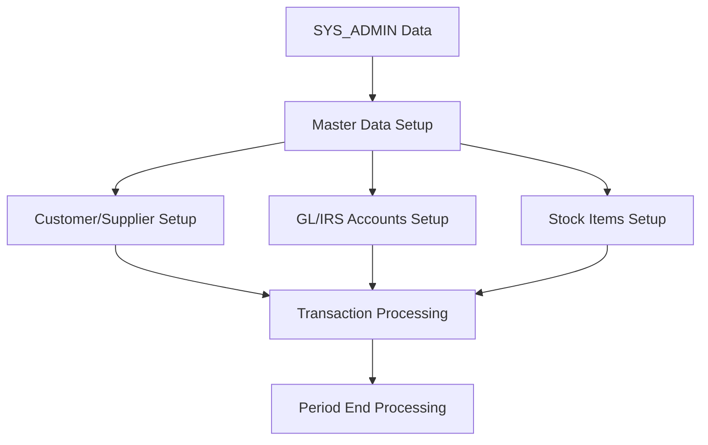

# ACAS Data Ownership Map

## Overview

This document maps all data entities (files and database tables) to their owning subsystems, defining clear boundaries for data governance, access patterns, and modernization planning. Each subsystem has primary ownership of specific data entities and may have read or update access to others.

## Data Ownership Principles

1. **Single Owner Rule**: Each data entity has exactly one owning subsystem
2. **Owner Responsibilities**: Create, update, delete, integrity, archival
3. **Access Patterns**: Other subsystems access through defined interfaces
4. **Boundary Enforcement**: No direct writes to another subsystem's data
5. **Master Data**: Shared configuration has designated owner

## Master Data Ownership Matrix

| Data Entity | Owner Subsystem | File/Table Name | Access Pattern | Business Purpose |
|-------------|-----------------|-----------------|----------------|------------------|
| **System Configuration** ||||
| System Parameters | SYS_ADMIN | SYSTEM.DAT | Read-Only by all | Global configuration |
| Company Details | SYS_ADMIN | SYSTEM.DAT | Read-Only by all | Legal entity info |
| VAT Configuration | SYS_ADMIN | SYSTEM.DAT | Read-Only by all | Tax rates |
| Period Control | SYS_ADMIN | SYSTEM.DAT | Update by PERIOD_PROC | Accounting periods |
| **Master Data** ||||
| Analysis Codes | SYS_ADMIN | ANALYSIS.DAT | Read by SL/PL/ST | Product categories |
| Delivery Addresses | SYS_ADMIN | DELIVERY.DAT | Read/Write by SL/PL | Alternate addresses |

## Core Business Data Ownership

### GL_CORE - General Ledger Core

| Data Entity | File/Table | Type | Description | Access |
|-------------|------------|------|-------------|---------|
| GL Accounts | GLLEDGER | Master | Chart of accounts | Owner |
| GL Postings | GLPOSTING | Transaction | Journal entries | Owner |
| GL Batches | GLBATCH | Control | Batch headers | Owner |
| Archive | ARCHIVE | History | Posted transactions | Owner |
| GL Finals | GLFINAL | Config | Final accounts setup | Owner |

**Access Patterns**:
- Receives posting records from SL_MGMT, PL_MGMT, ST_CTRL
- No external systems write directly to GL data

### IRS_CORE - IRS Ledger Core

| Data Entity | File/Table | Type | Description | Access |
|-------------|------------|------|-------------|---------|
| IRS Accounts | IRSNL | Master | IRS chart of accounts | Owner |
| IRS Postings | IRSPOSTING | Transaction | IRS journal entries | Owner |
| IRS Defaults | IRSDFLT | Config | Posting defaults | Owner |
| IRS Finals | IRSFINAL | Config | Final accounts | Owner |

**Access Patterns**:
- Receives posting records from SL_MGMT, PL_MGMT via SLPOSTING file
- Isolated from GL_CORE (business choice: GL OR IRS, not both)

### SL_MGMT - Sales Ledger Management

| Data Entity | File/Table | Type | Description | Access |
|-------------|------------|------|-------------|---------|
| Customers | SALEDGER | Master | Customer accounts | Owner |
| Sales Invoices | SAINVOICE | Transaction | Invoice headers | Owner |
| Invoice Lines | SAINV-LINES | Transaction | Invoice details | Owner |
| Open Items | SAITM3 | Transaction | Unpaid invoices | Owner |
| SL Postings | SLPOSTING | Interface | GL/IRS postings | Owner |
| Payments | PAYMENTS | Transaction | Customer payments | Shared with PL |
| Standing Orders | SAAUTOGEN | Config | Recurring invoices | Owner |
| Deleted Invoices | SADELINV | Audit | Deleted invoice numbers | Owner |

**External Access**:
- Writes to STOCK via ST_CTRL interfaces
- Creates posting records for GL/IRS consumption
- Reads ANALYSIS codes from SYS_ADMIN

### PL_MGMT - Purchase Ledger Management  

| Data Entity | File/Table | Type | Description | Access |
|-------------|------------|------|-------------|---------|
| Suppliers | PULEDGER | Master | Supplier accounts | Owner |
| Purchase Orders | PUINVOICE | Transaction | PO/Invoice headers | Owner |
| Open Items | PUITM5 | Transaction | Unpaid invoices | Owner |
| PL Postings | PLPOSTING | Interface | GL/IRS postings | Owner |
| Payments | PAYMENTS | Transaction | Supplier payments | Shared with SL |
| Standing Orders | PUAUTOGEN | Config | Recurring orders | Owner |
| Deleted Documents | DELFOLIO | Audit | Cancelled POs | Owner |

**External Access**:
- Writes to STOCK via ST_CTRL interfaces  
- Creates posting records for GL/IRS consumption
- Reads ANALYSIS codes from SYS_ADMIN

### ST_CTRL - Stock Control System

| Data Entity | File/Table | Type | Description | Access |
|-------------|------------|------|-------------|---------|
| Stock Items | STOCK | Master | Inventory items | Owner |
| Stock Movements | AUDIT | Transaction | Movement history | Owner |
| Stock Work File | TMP-STOCK | Temp | Processing work file | Owner |

**External Access**:
- Updated by SL_MGMT (deductions) and PL_MGMT (additions)
- Reads supplier data from PL_MGMT for reorder info
- Creates adjustment postings for GL/IRS

## Supporting Data Ownership

### BATCH_FW - Batch Processing Framework

| Data Entity | File/Table | Type | Description | Access |
|-------------|------------|------|-------------|---------|
| Pre-transaction | pretrans.tmp | Temp | Validation work | Owner |
| Post-transaction | postrans.tmp | Temp | Posting work | Owner |

**Note**: Batch control records are owned by respective subsystems (GLBATCH by GL_CORE)

### PERIOD_PROC - Period Processing

| Data Entity | File/Table | Type | Description | Access |
|-------------|------------|------|-------------|---------|
| Value Records | VALUE.DAT | Summary | Period summaries | Owner |
| Sort Work | Various .tmp | Temp | Sort work files | Owner |

**Special Access**: Updates period/year in SYSTEM.DAT (SYS_ADMIN owned)

## Data Access Patterns

### Read-Only Access Matrix

| Subsystem | Reads From | Data Elements |
|-----------|------------|---------------|
| SL_MGMT | SYS_ADMIN | System params, analysis codes |
| | ST_CTRL | Stock availability |
| | PL_MGMT | None |
| PL_MGMT | SYS_ADMIN | System params, analysis codes |
| | ST_CTRL | Stock on order |
| | SL_MGMT | None |
| ST_CTRL | SYS_ADMIN | System params, analysis codes |
| | PL_MGMT | Supplier info |
| | SL_MGMT | None |
| GL_CORE | SYS_ADMIN | System params |
| | SL_MGMT | Posting file |
| | PL_MGMT | Posting file |
| IRS_CORE | SYS_ADMIN | System params |
| | SL_MGMT | Posting file |
| | PL_MGMT | Posting file |

### Write Access Matrix

| Subsystem | Writes To | Data Elements | Method |
|-----------|-----------|---------------|---------|
| SL_MGMT | ST_CTRL | Stock quantities | Direct call |
| | GL/IRS | Posting records | File transfer |
| PL_MGMT | ST_CTRL | Stock quantities | Direct call |
| | GL/IRS | Posting records | File transfer |
| ST_CTRL | GL/IRS | Adjustment postings | File transfer |
| PERIOD_PROC | SYS_ADMIN | Period/year update | Direct update |

## Data Lifecycle Management

### Data Retention by Subsystem

| Subsystem | Data Type | Online Retention | Archive Policy |
|-----------|-----------|------------------|----------------|
| GL_CORE | Postings | Current + 1 year | 7 years |
| | Account balances | Permanent | N/A |
| IRS_CORE | Postings | Current year | 7 years |
| | Account balances | Permanent | N/A |
| SL_MGMT | Invoices | Until paid + 90 days | 7 years |
| | Customer master | Permanent | N/A |
| | Open items | Until closed | N/A |
| PL_MGMT | Orders/Invoices | Until paid + 90 days | 7 years |
| | Supplier master | Permanent | N/A |
| | Open items | Until closed | N/A |
| ST_CTRL | Stock master | Permanent | N/A |
| | Movements | Current + 1 year | 3 years |

### Data Purge Responsibilities

| Subsystem | Purge Process | Frequency | Trigger |
|-----------|---------------|-----------|---------|
| GL_CORE | Archive postings | Annual | Year-end |
| IRS_CORE | Archive postings | Annual | Year-end |
| SL_MGMT | Delete closed invoices | Monthly | Period-end |
| PL_MGMT | Delete closed orders | Monthly | Period-end |
| ST_CTRL | Purge old movements | Annual | Year-end |

## Data Integrity Rules

### Referential Integrity

| Parent Entity | Child Entity | Rule | Enforcement |
|--------------|--------------|------|-------------|
| SALEDGER | SAINVOICE | Customer must exist | Application |
| PULEDGER | PUINVOICE | Supplier must exist | Application |
| STOCK | AUDIT | Stock item must exist | Application |
| GLLEDGER | GLPOSTING | GL account must exist | Application |
| SAINVOICE | SAINV-LINES | Invoice must exist | Application |
| ANALYSIS | Various | Analysis code must exist | Application |

### Business Rule Enforcement

| Rule | Owner | Enforcement Point |
|------|-------|-------------------|
| Customer credit limit | SL_MGMT | Invoice entry |
| Stock availability | ST_CTRL | Invoice/order entry |
| Period closed | SYS_ADMIN | All posting programs |
| VAT calculation | SL/PL_MGMT | Invoice/order entry |
| Batch balance | BATCH_FW | Posting programs |

## Data Migration Considerations

### Subsystem Data Dependencies

### Migration Order
1. System parameters and configuration
2. Analysis codes and master data
3. GL/IRS chart of accounts
4. Customer and supplier masters
5. Stock items and starting balances
6. Open transactions
7. Historical data (if required)

## Data Quality Governance

### Data Quality Ownership

| Data Domain | Quality Owner | Key Metrics |
|-------------|--------------|-------------|
| Customer Data | SL_MGMT | Completeness, accuracy |
| Supplier Data | PL_MGMT | Completeness, accuracy |
| Product Data | ST_CTRL | Consistency, validity |
| Financial Data | GL/IRS_CORE | Balance, integrity |
| System Config | SYS_ADMIN | Consistency, validity |

### Data Validation Points

| Validation | Subsystem | When Applied |
|------------|-----------|--------------|
| Check digits | SL/PL_MGMT | Customer/supplier entry |
| Date validation | All | Transaction entry |
| Amount validation | All | Money field entry |
| Code validation | All | Reference code entry |
| Balance validation | BATCH_FW | Batch posting |

## Security and Access Control

### Data Access Levels

| Level | Description | Subsystems |
|-------|-------------|------------|
| Public | Read by all subsystems | System parameters |
| Protected | Read by many, write by one | Analysis codes |
| Private | Read/write by owner only | Transaction data |
| Restricted | Special authorization required | Period closing |

### Sensitive Data Classification

| Data Element | Classification | Owner | Special Handling |
|--------------|----------------|-------|------------------|
| Bank details | Confidential | PL_MGMT | Encryption recommended |
| Credit limits | Sensitive | SL_MGMT | Audit trail required |
| Cost prices | Sensitive | ST_CTRL | Role-based access |
| VAT numbers | Regulated | SYS_ADMIN | Validation required |

---

Document Version: 1.0
Analysis Date: December 2024