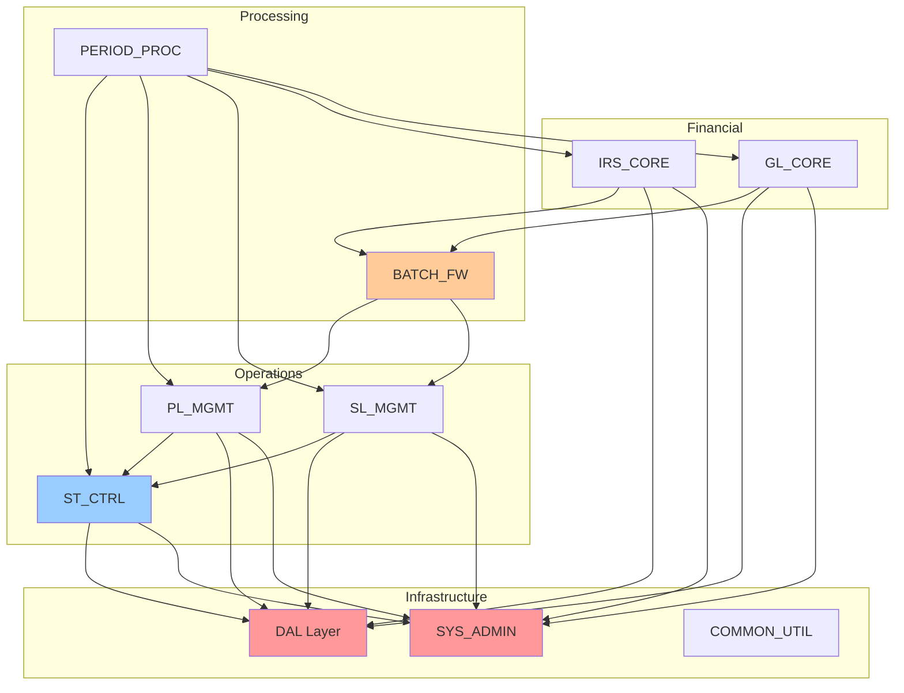
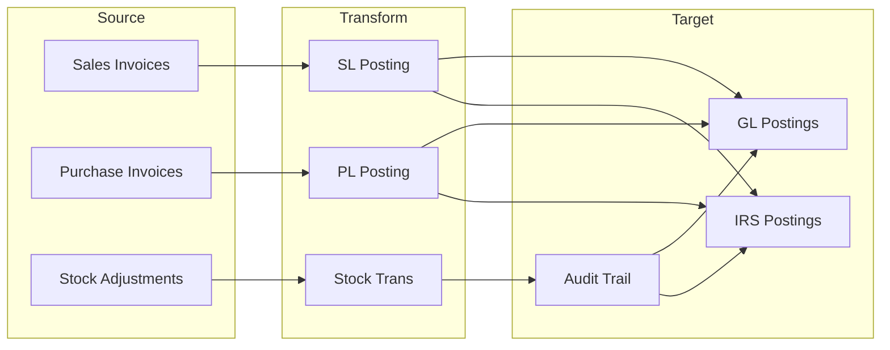
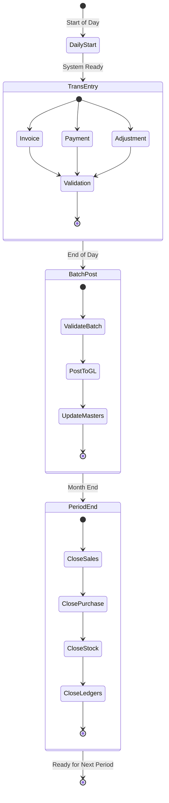
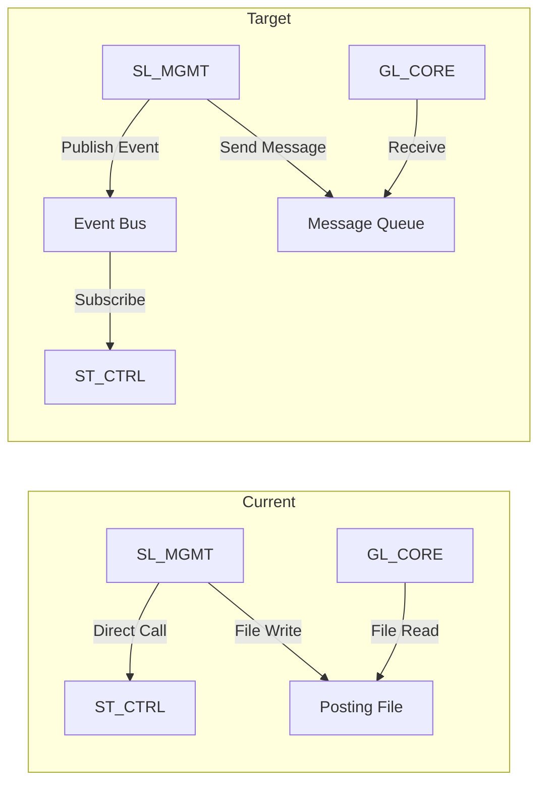

# ACAS Subsystem Dependency Analysis

## Overview

This document provides a comprehensive analysis of dependencies between ACAS subsystems, identifying coupling points, dependency strengths, and potential areas for decoupling. Understanding these dependencies is crucial for planning subsystem extraction, modernization sequencing, and risk assessment.

## Dependency Classification

### Dependency Types

| Type | Description | Coupling Level | Example |
|------|-------------|----------------|---------|
| **Data Dependency** | Direct access to another's data | High | SL reads Stock quantities |
| **Functional Dependency** | Calls another's programs | High | SL calls Stock handlers |
| **Interface Dependency** | Uses defined interface | Medium | SL writes posting file for GL |
| **Configuration Dependency** | Reads shared config | Low | All read system parameters |
| **Temporal Dependency** | Requires specific order | Medium | Period close sequence |
| **Behavioral Dependency** | Assumes specific behavior | High | Invoice expects stock update |

### Dependency Strength Metrics

| Strength | Criteria | Refactoring Effort | Risk Level |
|----------|----------|-------------------|------------|
| **Critical** | System fails without it | Very High | Extreme |
| **Strong** | Major functionality impaired | High | High |
| **Moderate** | Some features unavailable | Medium | Medium |
| **Weak** | Minor impact only | Low | Low |
| **Optional** | Enhanced functionality only | Minimal | Minimal |

## Core Dependencies Matrix

### Direct Dependencies

| Subsystem | Depends On | Dependency Type | Strength | Description |
|-----------|------------|-----------------|----------|-------------|
| **GL_CORE** | SYS_ADMIN | Configuration | Critical | System parameters |
| | BATCH_FW | Functional | Strong | Posting mechanism |
| | SL_MGMT | Interface | Moderate | Posting file |
| | PL_MGMT | Interface | Moderate | Posting file |
| **IRS_CORE** | SYS_ADMIN | Configuration | Critical | System parameters |
| | BATCH_FW | Functional | Strong | Posting mechanism |
| | SL_MGMT | Interface | Moderate | Posting file |
| | PL_MGMT | Interface | Moderate | Posting file |
| **SL_MGMT** | SYS_ADMIN | Configuration | Critical | System parameters |
| | ST_CTRL | Data/Functional | Strong | Stock availability |
| | DAL | Functional | Critical | Data access |
| | COMMON_UTIL | Functional | Moderate | Date, validation |
| **PL_MGMT** | SYS_ADMIN | Configuration | Critical | System parameters |
| | ST_CTRL | Data/Functional | Strong | Stock updates |
| | DAL | Functional | Critical | Data access |
| | COMMON_UTIL | Functional | Moderate | Date, validation |
| **ST_CTRL** | SYS_ADMIN | Configuration | Critical | System parameters |
| | DAL | Functional | Critical | Data access |
| | PL_MGMT | Data | Weak | Supplier info |

### Inverse Dependencies (Used By)

| Subsystem | Used By | Usage Type | Impact if Removed |
|-----------|---------|------------|-------------------|
| **SYS_ADMIN** | All | Configuration | System inoperable |
| **DAL** | All business | Data access | No data access |
| **COMMON_UTIL** | All | Utilities | Limited functionality |
| **ST_CTRL** | SL_MGMT, PL_MGMT | Stock management | No inventory control |
| **BATCH_FW** | GL_CORE, IRS_CORE | Posting control | No financial posting |

## Dependency Graphs

### System-Level Dependencies

### Data Flow Dependencies

## Coupling Analysis

### Tight Coupling Points

| Coupling Point | Subsystems | Type | Risk | Mitigation Strategy |
|----------------|------------|------|------|-------------------|
| Stock Updates | SL↔ST, PL↔ST | Synchronous call | High | Event-driven updates |
| System Config | All→SYS_ADMIN | Direct file read | Medium | Configuration service |
| Posting Files | SL/PL→GL/IRS | File dependency | Medium | Message queue |
| Period Close | PERIOD→All | Orchestration | High | Workflow engine |
| Data Access | All→DAL | Library coupling | Critical | Repository pattern |

### Coupling Metrics

| Subsystem | Afferent Coupling | Efferent Coupling | Instability | Abstractness |
|-----------|------------------|-------------------|-------------|--------------|
| SYS_ADMIN | 10 | 0 | 0.0 | 0.2 |
| DAL | 8 | 2 | 0.2 | 0.8 |
| GL_CORE | 2 | 4 | 0.67 | 0.3 |
| IRS_CORE | 2 | 4 | 0.67 | 0.3 |
| SL_MGMT | 1 | 5 | 0.83 | 0.2 |
| PL_MGMT | 1 | 5 | 0.83 | 0.2 |
| ST_CTRL | 3 | 3 | 0.5 | 0.1 |

**Metrics Explanation**:
- **Afferent Coupling**: Number of subsystems that depend on this one
- **Efferent Coupling**: Number of subsystems this one depends on
- **Instability**: Efferent / (Afferent + Efferent) - higher = more likely to change
- **Abstractness**: Abstract components / Total components

## Temporal Dependencies

### Sequential Processing Requirements

### Critical Path Dependencies

| Process | Predecessor | Successor | Wait Time | Impact |
|---------|-------------|-----------|-----------|--------|
| Start of Day | System Init | All Transactions | Required | Blocks all |
| Invoice Posting | Invoice Entry | GL Posting | Batch window | Delays financials |
| Payment Posting | Payment Entry | GL Posting | Batch window | Delays cash position |
| Stock Posting | Movements | Valuation | End of day | Affects inventory value |
| Period Close | All Postings | Next Period | Hours | Blocks new transactions |

## Circular Dependencies

### Identified Circular Dependencies

1. **None at Subsystem Level** - Architecture avoids circular dependencies
2. **Program Level Issues**:
   - Some shared copybooks create compile-time dependencies
   - DAL modules have bidirectional relationships with handlers

### Potential Circular Risks

| Risk Area | Current State | Potential Issue | Prevention |
|-----------|--------------|-----------------|------------|
| GL↔IRS | Mutually exclusive | Could conflict if both active | Configuration control |
| SL↔PL Payments | Shared file | Concurrent access issues | Separate payment files |
| Stock↔Orders | Tight coupling | Deadlock on updates | Async updates |

## Decoupling Strategies

### High-Priority Decoupling Opportunities

| Dependency | Current State | Target State | Approach | Effort |
|------------|--------------|--------------|----------|--------|
| Stock Updates | Direct calls | Event-driven | Publish stock events | High |
| Posting Files | File transfer | Message queue | Async messaging | Medium |
| System Config | File reads | Config service | REST API | Medium |
| Batch Processing | Monolithic | Microservices | Service decomposition | High |
| Period Close | Sequential | Parallel | Workflow orchestration | High |

### Decoupling Patterns

## Dependency Risk Assessment

### Risk Matrix

| Dependency | Likelihood of Change | Impact if Broken | Risk Level | Mitigation |
|------------|---------------------|------------------|------------|------------|
| DAL Layer | Low | Critical | High | Extensive testing |
| System Config | Low | Critical | High | Fallback config |
| Stock Integration | Medium | High | High | Circuit breaker |
| Posting Interface | Medium | Medium | Medium | Retry logic |
| Utilities | Low | Low | Low | Local copies |

### Impact Analysis

| If Subsystem Fails | Immediate Impact | Cascading Impact | Recovery Time |
|-------------------|------------------|------------------|---------------|
| SYS_ADMIN | No configuration | System unusable | Minutes |
| DAL | No data access | Complete failure | Hours |
| ST_CTRL | No stock control | Orders blocked | Hours |
| GL_CORE | No financial reports | Compliance issues | Days |
| SL_MGMT | No sales | Revenue impact | Hours |
| BATCH_FW | No posting | Financial delays | Hours |

## Modernization Sequencing

### Dependency-Based Extraction Order

1. **Phase 1 - Infrastructure** (Low business risk)
   - COMMON_UTIL - No dependencies
   - RPT_ENGINE - Read-only operations

2. **Phase 2 - Isolated Business** (Medium risk)
   - ST_CTRL - Clear boundaries
   - Extract with API wrapper

3. **Phase 3 - Integrated Business** (Higher risk)
   - SL_MGMT with event publishing
   - PL_MGMT with event publishing

4. **Phase 4 - Core Financial** (Highest risk)
   - BATCH_FW as orchestration service
   - GL_CORE/IRS_CORE as services

5. **Phase 5 - Foundation** (Critical)
   - DAL as data services
   - SYS_ADMIN as configuration service

### Parallel Extraction Opportunities

| Can Extract Together | Reason | Prerequisite |
|---------------------|--------|--------------|
| SL_MGMT + PL_MGMT | Similar patterns | Stock API ready |
| All report modules | Read-only | Data API ready |
| Utility functions | No dependencies | None |

## Recommendations

### Short-Term (Reduce Coupling)
1. Implement interface versioning
2. Add abstraction layers for cross-subsystem calls
3. Create asynchronous alternatives for synchronous operations
4. Implement circuit breakers for external dependencies

### Medium-Term (Prepare for Extraction)
1. Replace direct file access with API calls
2. Implement event publishing alongside current integration
3. Create subsystem health checks and monitoring
4. Build integration test suites

### Long-Term (Enable Microservices)
1. Complete event-driven architecture
2. Implement service mesh for communication
3. Container-ready subsystems
4. Full API gateway implementation

---

Document Version: 1.0  
Analysis Date: December 2024