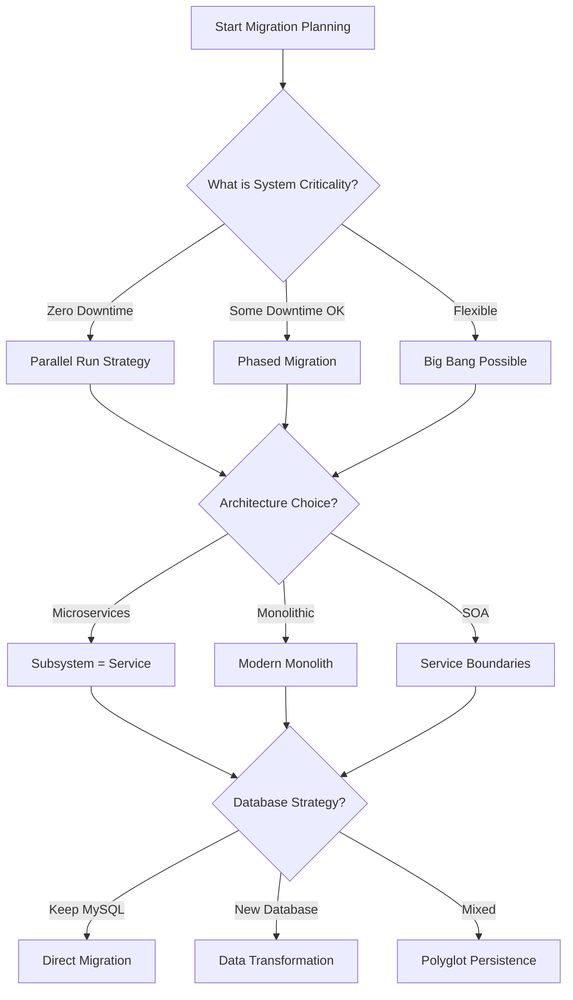

# ACAS Migration Quick Reference Decision Guide

## Critical Path Decision Tree

## Quick Decision Matrix

| If Your Situation Is... | Then Consider... | Because... |
|------------------------|------------------|------------|
| Zero downtime tolerance | Parallel run + Strangler Fig | Allows rollback and gradual transition |
| Limited COBOL expertise | Automated translation + Rewrite critical | Preserves logic while modernizing |
| Budget < $1M | Phased migration + Keep some COBOL | Spreads cost and risk |
| Need quick wins | Start with Reporting or Stock Control | Isolated subsystems, visible improvements |
| Heavy batch processing | Event-driven + Keep some batch | Gradual modernization of processing |
| Compliance critical | Big Bang with extensive testing | Clean audit trail and compliance cutover |

## Subsystem Migration Order Recommendations

### Option 1: Low Risk First
1. **SYS_ADMIN** - Simple, foundational
2. **RPT_ENGINE** - Read-only, high visibility
3. **ST_CTRL** - Relatively isolated
4. **COMMON_UTIL** - Shared services
5. **IRS_CORE** - Simpler than GL
6. **SL_MGMT** - Customer-facing
7. **PL_MGMT** - Supplier-facing
8. **GL_CORE** - Most critical
9. **BATCH_FW** - Complex dependencies
10. **PERIOD_PROC** - Requires all others
11. **DAL** - Throughout migration
12. **INTEG_SVC** - As needed

### Option 2: Business Value First
1. **RPT_ENGINE** - Immediate visibility
2. **SL_MGMT** - Customer experience
3. **ST_CTRL** - Inventory accuracy
4. **PL_MGMT** - Supplier management
5. **GL_CORE** - Financial reporting
6. Others follow...

### Option 3: Technical Dependencies
1. **DAL** - Data layer first
2. **COMMON_UTIL** - Shared functions
3. **SYS_ADMIN** - Configuration
4. Core business subsystems
5. **BATCH_FW** - After cores stable
6. **PERIOD_PROC** - Last

## Technology Stack Recommendations

### For Conservative Approach
- **Language**: Java or C#
- **Database**: Keep MySQL/MariaDB
- **Architecture**: Modular monolith
- **UI**: Web-based traditional
- **Integration**: REST APIs

### For Modern Transformation
- **Language**: Go or Python
- **Database**: PostgreSQL + Redis
- **Architecture**: Microservices
- **UI**: React/Vue SPA
- **Integration**: Event streaming (Kafka)

### For Rapid Migration
- **Language**: Keep COBOL + Java wrapper
- **Database**: Migrate to cloud MySQL
- **Architecture**: Lift and shift first
- **UI**: Web terminal emulation
- **Integration**: Minimal changes

## Risk Mitigation Strategies

### Technical Risks
| Risk | Mitigation |
|------|------------|
| Undocumented logic | Extensive code analysis + SME interviews |
| Calculation differences | Parallel run with reconciliation |
| Performance degradation | Baseline metrics + continuous monitoring |
| Data loss | Multiple backup strategies + validation |

### Business Risks
| Risk | Mitigation |
|------|------------|
| User resistance | Early involvement + training |
| Process disruption | Phased approach + rollback plan |
| Knowledge loss | Document as you go + pair programming |
| Compliance issues | Audit trail preservation + testing |

## Quick Estimation Guide

### Timeline Estimates
- **Big Bang**: 12-18 months
- **Phased by Subsystem**: 18-36 months  
- **Parallel Run**: 24-36 months
- **With Coexistence**: 36+ months

### Team Size Estimates
- **Minimum Viable**: 8-10 people
- **Recommended**: 15-20 people
- **Accelerated**: 25-30 people
- **Include**: COBOL experts (2-3), architects (2), developers (8-10), QA (4-5), PM/BA (3-4)

### Budget Rough Estimates
- **Translation + Modernization**: $2-3M
- **Complete Rewrite**: $3-5M
- **With Process Reengineering**: $5-8M
- **Factors**: Team size, timeline, technology choices, testing rigor

## Common Pitfalls to Avoid

1. **Underestimating COBOL Complexity**
   - Hidden business rules in code
   - Undocumented features
   - Complex batch dependencies

2. **Ignoring Data Migration**
   - ISAM to relational isn't trivial
   - Data quality issues compound
   - Historical data requirements

3. **Insufficient Testing**
   - Financial calculations need extensive validation
   - Edge cases in 40-year-old code
   - Batch process timing dependencies

4. **Change Management**
   - Users comfortable with green screens
   - Embedded business processes
   - Training requirements

## Success Factors Checklist

- [ ] Executive sponsorship secured
- [ ] COBOL expertise available throughout
- [ ] Clear success metrics defined
- [ ] Rollback strategy defined
- [ ] Testing strategy comprehensive
- [ ] Training plan developed
- [ ] Data migration tool selected
- [ ] Integration patterns defined
- [ ] Performance baselines established
- [ ] Compliance requirements documented

## Quick Contact Decision Points

When you encounter these situations, immediately address:

1. **Batch job runs past window** → Decide real-time vs batch strategy
2. **Calculation variance found** → Define acceptable tolerance
3. **Unknown COBOL pattern** → Engage COBOL expert
4. **Integration point discovered** → Update architecture
5. **Performance degradation** → Review technology choice
6. **User resistance high** → Enhance change management
7. **Budget pressure** → Adjust scope or timeline
8. **Resource unavailable** → Reprioritize or extend

## Red Flags Requiring Immediate Attention

- Discovery of hard-coded business logic not in documentation
- Calculation differences in parallel run
- Key COBOL resource leaving project
- Critical integration point not previously identified
- Compliance requirement not addressed
- Performance 10x slower than legacy
- Data migration errors above threshold
- Users reverting to manual processes

## Green Flags Indicating Success

- Subsystem migrated with zero defects
- Users requesting new features
- Performance improvements noticed
- Successful month-end processing
- Clean audit with new system
- Reduced support tickets
- Business process improvements identified
- On time and on budget for phase

---

*Use this guide for quick decisions. For detailed analysis, refer to the complete questionnaire.*