# ACAS Technical Manual

## Table of Contents

1. [Executive Overview](#1-executive-overview)
2. [User Interaction and Navigation](#2-user-interaction-and-navigation)
3. [General Ledger Management](#3-general-ledger-management)
4. [Sales Ledger Management](#4-sales-ledger-management)
5. [Purchase Ledger Management](#5-purchase-ledger-management)
6. [Stock Control and Inventory Management](#6-stock-control-and-inventory-management)
7. [Reporting Suite](#7-reporting-suite)
8. [System Configuration and Setup](#8-system-configuration-and-setup)
9. [Data Migration, Conversion and Backup](#9-data-migration-conversion-and-backup)
10. [Validation, Error Handling and Audit Trail](#10-validation-error-handling-and-audit-trail)
11. [Appendices](#11-appendices)

---

## 1. Executive Overview

### 1.1 Purpose of the Accounting System

ACAS (Applewood Computers Accounting System) is a comprehensive COBOL-based accounting and business management system that provides integrated modules for complete financial management. The system has been actively maintained since its original development in 1976, demonstrating exceptional longevity and reliability.

**Core Purpose:**
- Provide full accounting capabilities for small to medium-sized businesses
- Support both traditional double-entry bookkeeping and simplified accounting for incomplete records
- Ensure compliance with UK VAT regulations and accounting standards
- Maintain complete audit trails for all financial transactions

**System Architecture:**
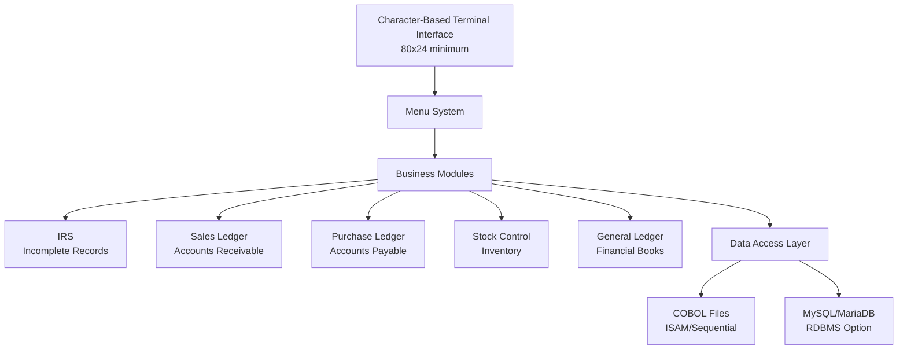

*Source: /1_FUNCTIONAL DOCUMENTATION/00_ACAS_Executive_Summary.md*

### 1.2 Key Business Processes Supported

The ACAS system supports comprehensive business processes across the entire accounting cycle:

**Financial Management:**
- Complete order-to-cash cycle (customer orders through payment collection)
- Full procure-to-pay cycle (purchase requisitions through supplier payment)
- Period-end closing procedures (monthly, quarterly, annual)
- Financial statement preparation (Trial Balance, P&L, Balance Sheet)
- Tax compliance and VAT reporting

**Operational Management:**
- Inventory control with multiple valuation methods
- Customer credit management and collections
- Supplier relationship management
- Multi-location stock management
- Reorder point optimization

**Reporting and Analysis:**
- Real-time financial position reporting
- Aged receivables and payables analysis
- Sales and purchase trend analysis
- Stock valuation and movement reports
- Management dashboards and KPIs

*Source: /1_FUNCTIONAL DOCUMENTATION/00_ACAS_Executive_Summary.md, /1_FUNCTIONAL DOCUMENTATION/05_ACAS_Business_Flows_Enhanced.md*

---

## 2. User Interaction and Navigation

### 2.1 Main System Menus

The ACAS system uses a hierarchical menu structure with the main ACAS program as the entry point. Navigation is performed through numeric menu selections on character-based terminals.

**Main Menu Structure:**
```
ACAS MAIN MENU
==============
1. Incomplete Records System (IRS)
2. Sales Ledger
3. Purchase Ledger  
4. Stock Control
5. General Ledger
6. System Administration
0. Exit
```

Each module has its own sub-menu accessed through the module's main program:
- `irs` - IRS module menu
- `sales` - Sales Ledger menu
- `purchase` - Purchase Ledger menu
- `stock` - Stock Control menu
- `general` - General Ledger menu

*Source: /1_FUNCTIONAL DOCUMENTATION/01_ACAS_Program_Catalog.md*

### 2.2 Sub-Menu Navigation Flow

Each module follows a consistent sub-menu pattern:

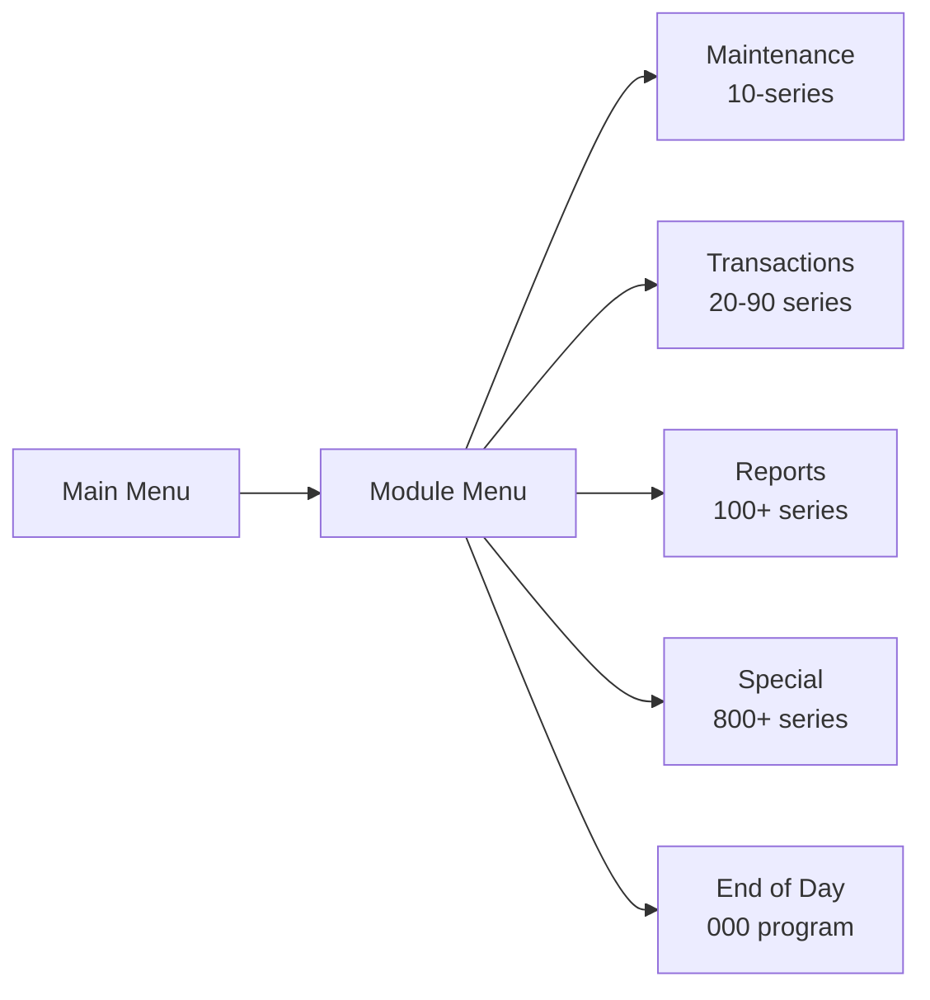

**Standard Program Numbering:**
- xx000: Start of day initialization
- xx010-xx090: Maintenance and transaction entry
- xx100-xx190: Reports and inquiries
- xx800-xx970: Special functions (standing orders, batch processes)

*Source: /1_FUNCTIONAL DOCUMENTATION/01_ACAS_Program_Catalog.md*

### 2.3 Screen Layout and User Guidance

The system uses a standardized 80x24 character screen layout:

```
Line 1-2:   System Header (Company Name, Module, Date)
Line 3-4:   Screen Title and Function
Line 5-20:  Data Entry/Display Area
Line 21:    Message Line
Line 22:    Status Line  
Line 23-24: Function Key Options
```

**User Interface Standards:**
- Function keys: F1=Help, F3=Exit, F5=Accept, F7=Delete
- Data entry: Tab between fields, Enter to confirm
- Navigation: Numeric menu choices, PgUp/PgDn for lists
- Messages: Error messages in red, confirmations in green

**Screen Navigation Example (Customer Maintenance):**
```
====================================== ACAS SALES LEDGER ======================================
                               CUSTOMER MAINTENANCE - sl010
                                     
Customer Code: [_______]  Check Digit: [_]

Name:          [______________________________]
Address:       [______________________________]
               [______________________________]
               [______________________________]
Post Code:     [________]

Credit Limit:  [________]  Credit Period (days): [___]
Discount %:    [___.__]    Late Charge Flag:     [_]

Current Balance: £______.__  
                                     
================================================================================
Message: Enter customer code or press F3 to exit
================================================================================
F1=Help  F3=Exit  F5=Accept  F7=Delete  F9=Search
```

*Source: /1_FUNCTIONAL DOCUMENTATION/01_ACAS_Program_Catalog.md, /0_COBOL PARSER/parser_analysis/docs/sales-documentation.md*

---

## 3. General Ledger Management

### 3.1 Chart of Accounts Maintenance

The Chart of Accounts is maintained through program `gl020` with a hierarchical structure supporting multiple reporting levels.

**Account Structure:**
- Account Number: 6 digits + 2 digit profit center = 8 total
- Account Types:
  - 1 = Balance Sheet accounts
  - 2 = Profit & Loss accounts  
  - 9 = Header/grouping accounts

**Account Hierarchy Levels:**
- Level 1-9: Used for report aggregation and grouping
- Headers (type 9) provide structure without balances
- Detail accounts (types 1-2) hold actual balances

**Maintenance Process Flow:**
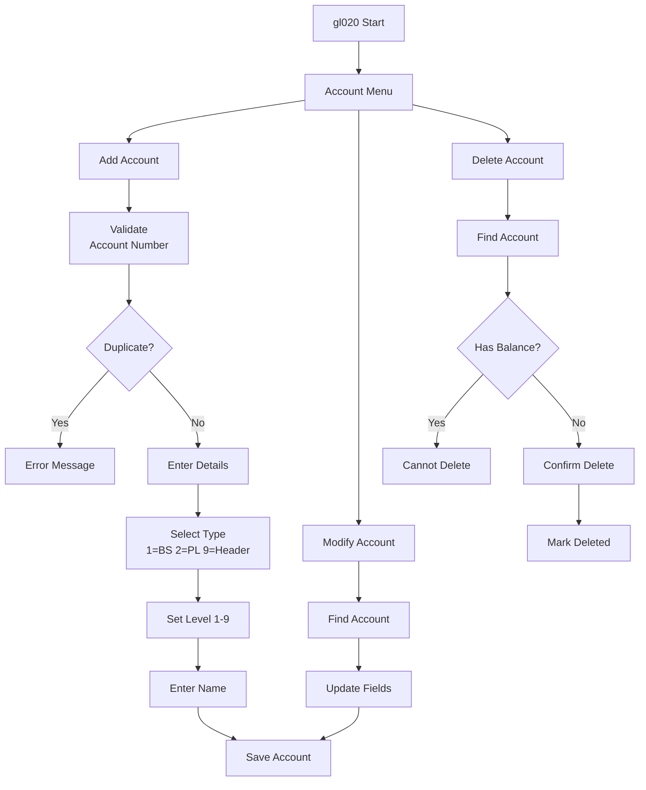

*Source: /2_SUBSYSTEMS DOCUMENTATION/Subsystems/GL_CORE/GL_CORE_SPECIFICATION.md*

### 3.2 Default Account Settings

Default accounts are configured through program `gl030` to automate posting from subsidiary ledgers.

**Key Default Accounts:**
- Sales Control Account (from Sales Ledger)
- Purchase Control Account (from Purchase Ledger)
- VAT Control Accounts (Input/Output)
- Bank Accounts (by currency/type)
- Retained Earnings
- Suspense Account

**Configuration Requirements:**
- Each subsidiary ledger must have control accounts defined
- VAT accounts must match system VAT rate configuration
- Profit centers must have complete default sets

*Source: /2_SUBSYSTEMS DOCUMENTATION/Subsystems/GL_CORE/GL_CORE_SPECIFICATION.md*

### 3.3 Batch Posting Creation and Amendment

GL uses a two-phase batch posting system through programs `gl050` (entry) and `gl051` (amendment):

**Batch Creation Process:**
1. System assigns sequential 6-digit batch number
2. Enter batch header (date, description, control total)
3. Add journal lines:
   - Debit/Credit account selection
   - Amount entry with automatic balancing
   - Description/reference fields
4. System validates debits = credits continuously

**Batch Status Workflow:**
```
0 = Open (entry/modification allowed)
1 = Proofed (validated, ready to post)
2 = Posted (committed to ledger)
```

**Amendment Rules:**
- Only Open (status 0) batches can be modified
- Proofed batches must be re-opened for changes
- Posted batches cannot be changed (must reverse)

*Source: /2_SUBSYSTEMS DOCUMENTATION/Subsystems/GL_CORE/GL_CORE_SPECIFICATION.md*

### 3.4 Batch Status Reporting

Program `gl072` provides comprehensive batch status reporting:

**Report Contents:**
- Batch number, date, and description
- Entry status (Open/Proofed/Posted)
- Control totals vs actual totals
- Line count and validation status
- User ID and timestamps

**Report Selection Options:**
- All batches
- Open batches only
- Date range selection
- Specific batch number

*Source: /1_FUNCTIONAL DOCUMENTATION/01_ACAS_Program_Catalog.md*

### 3.5 End-of-Cycle Archiving and Period Closure

Period closure is managed through program `gl080`:

**End-of-Period Process:**
1. Verify all batches posted (no open/proofed batches)
2. Run trial balance to confirm debits = credits
3. Generate period-end reports
4. Archive posted transactions to sequential file
5. Clear posting file for next period
6. Update account period balances
7. Advance system period

**Year-End Additional Steps:**
- Calculate P&L net income/loss
- Post to retained earnings
- Zero out P&L accounts
- Create opening balances for new year
- Archive full year transactions

**NOT IMPLEMENTED: Programs gl040 (Final Accounts Setup), gl130 (Print Final Accounts), and gl190 (File Garbage Collector) are missing from the system. These programs are required for complete final accounts processing.**

*Source: /2_SUBSYSTEMS DOCUMENTATION/Subsystems/GL_CORE/GL_CORE_SPECIFICATION.md, /4_DOCUMENTATION/ACAS_COMPREHENSIVE_REPORT.md*

---

## 4. Sales Ledger Management

### 4.1 Customer Master Creation and Maintenance

Customer records are managed through program `sl010` with comprehensive credit control features:

**Customer Setup Process:**
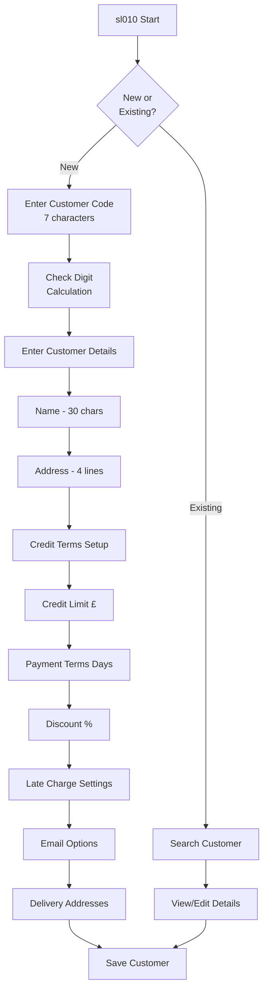

**Key Customer Attributes:**
- Customer Code: 7 characters with check digit validation
- Credit Limit: Maximum outstanding balance allowed
- Payment Terms: Days until payment due
- Settlement Discount: % for early payment
- Late Charge Flag: Y/N for automatic charges
- Email Flags: For statements and invoices

*Source: /2_SUBSYSTEMS DOCUMENTATION/Subsystems/SL_MGMT/SL_MGMT_SPECIFICATION.md, /1_FUNCTIONAL DOCUMENTATION/05_ACAS_Business_Flows_Enhanced.md*

### 4.2 Invoice Entry, Amendment and Deletion

Invoice management uses multiple programs for different modes:
- `sl910`: Immediate invoice entry and printing
- `sl900`: Batch invoice entry
- `sl920`: Invoice amendment (unposted only)
- `sl950`: Invoice deletion

**Invoice Entry Flow:**
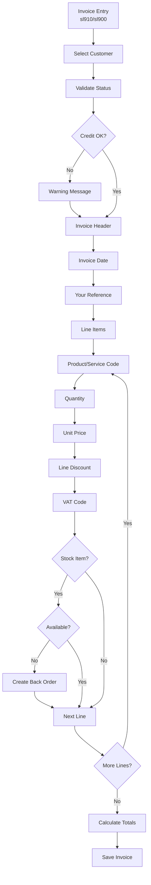

**Amendment Rules:**
- Only unposted invoices can be amended
- Posted invoices require credit note and re-invoice
- Deleted invoice numbers tracked for audit

*Source: /1_FUNCTIONAL DOCUMENTATION/05_ACAS_Business_Flows_Enhanced.md, /0_COBOL PARSER/parser_analysis/docs/sales-documentation.md*

### 4.3 Payment Recording and Allocation

Customer payments are processed through programs `sl080` (entry) and `sl100` (posting):

**Payment Processing Flow:**
1. Select customer account
2. Enter payment details:
   - Payment amount
   - Check/reference number
   - Payment date
   - Payment method
3. System displays open invoices
4. Allocation options:
   - Automatic (oldest first)
   - Manual selection
5. Early payment discount calculation
6. Generate allocation list

**Allocation Rules:**
- FIFO default (configurable)
- Partial payments allowed
- Discount only if within terms
- Over-payments create credit balance

*Source: /1_FUNCTIONAL DOCUMENTATION/05_ACAS_Business_Flows_Enhanced.md*

### 4.4 Invoice Proofing and Posting to Ledger

Invoice validation and posting uses a two-stage process:

**Stage 1 - Proofing (sl055):**
- List all unposted invoices
- Validate totals and VAT calculations
- Check analysis codes
- Verify customer credit status
- Identify potential issues

**Stage 2 - Posting (sl060):**
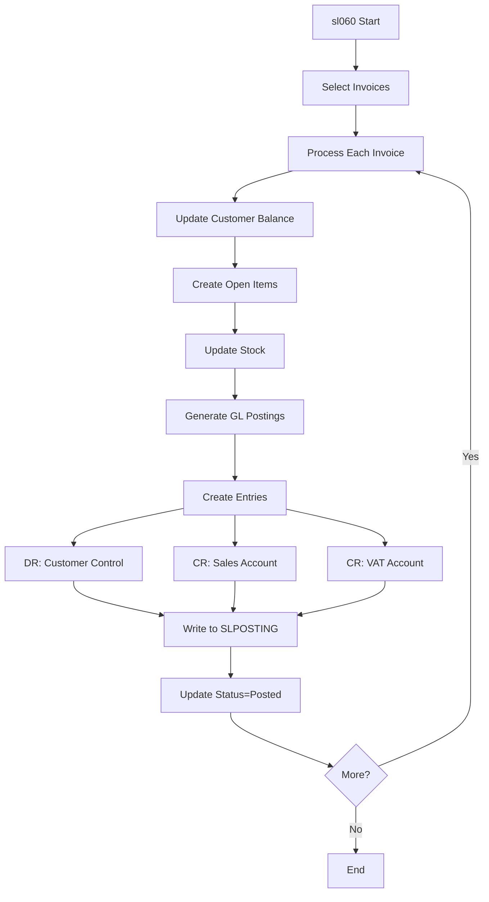

*Source: /2_SUBSYSTEMS DOCUMENTATION/Subsystems/SL_MGMT/SL_MGMT_SPECIFICATION.md*

### 4.5 Sales Analysis and Reporting

Sales analysis provided through multiple report programs:

**sl130 - Product Analysis Report:**
- Sales by product/service code
- Period and year-to-date comparisons
- Quantity and value analysis
- Profit margins (if cost available)
- Top sellers identification

**sl180 - Customer Turnover Report:**
- Customer ranking by revenue
- Period comparisons
- Payment performance
- Credit utilization

**Report Selection Options:**
- Date ranges
- Product categories
- Customer groups
- Minimum values
- Sort sequences

*Source: /1_FUNCTIONAL DOCUMENTATION/01_ACAS_Program_Catalog.md*

### 4.6 Back-Order Tracking and Management

Back-order handling is integrated into the invoice entry process:

**Automatic Back-Order Creation:**
- Triggered when stock unavailable
- Maintains original order details
- Links to customer and invoice
- Tracks expected delivery date

**Back-Order Processing:**
- Review through sl020 (enquiry)
- Automatic allocation when stock received
- Priority allocation rules
- Customer notification options

**Back-Order Reports:**
- Outstanding by customer
- Outstanding by product
- Aging analysis
- Expected fulfillment dates

*Source: /1_FUNCTIONAL DOCUMENTATION/05_ACAS_Business_Flows_Enhanced.md*

---

## 5. Purchase Ledger Management

### 5.1 Supplier Master Creation and Maintenance

Supplier records are managed through program `pl010`:

**Supplier Setup Requirements:**
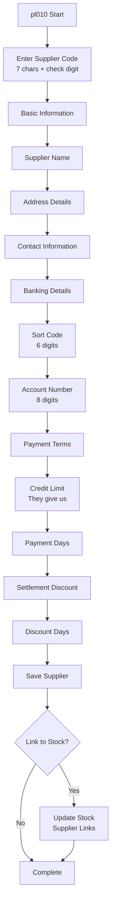

**Key Supplier Attributes:**
- Supplier Code: 7 characters with check digit
- Bank Details: For payment processing
- Credit Terms: Payment days allowed
- Settlement Discount: % and days for early payment
- Delivery addresses: Multiple locations
- Stock linkage: Up to 3 suppliers per item

*Source: /2_SUBSYSTEMS DOCUMENTATION/Subsystems/PL_MGMT/PL_MGMT_SPECIFICATION.md, /1_FUNCTIONAL DOCUMENTATION/05_ACAS_Business_Flows_Enhanced.md*

### 5.2 Purchase Order Entry, Amendment and Deletion

Purchase order management through programs:
- `pl020`: Order entry
- `pl030`: Order amendment
- `pl040`: Order/Invoice deletion
- `pl900`: Batch order processing

**Order Entry Process:**
1. Select supplier
2. Enter order header:
   - Order date
   - Required delivery date
   - Delivery instructions
   - Buyer reference
3. Add line items:
   - Product/service code
   - Quantity required
   - Agreed unit price
   - VAT code
4. System calculates totals
5. Print or queue order

*Source: /1_FUNCTIONAL DOCUMENTATION/05_ACAS_Business_Flows_Enhanced.md*

### 5.3 Receipt and Credit Note Processing

Goods receipt through program `pl025`:

**Receipt Process Flow:**
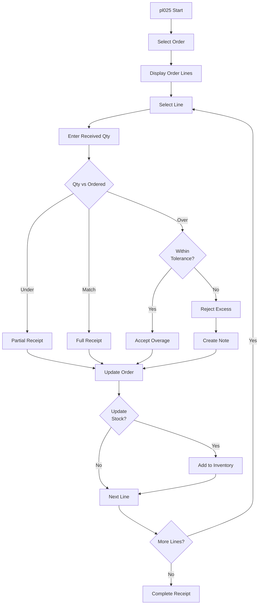

**Credit Note Processing:**
- Create through order entry with negative quantities
- Link to original invoice for tracking
- Automatic supplier balance adjustment
- Stock adjustment if applicable

*Source: /2_SUBSYSTEMS DOCUMENTATION/Subsystems/PL_MGMT/PL_MGMT_SPECIFICATION.md*

### 5.4 Payment Posting to Supplier Accounts

Payment processing uses programs:
- `pl080`: Payment selection
- `pl085`: Payment amendment
- `pl095`: Check printing
- `pl100`: Payment posting

**Payment Selection Process:**
1. Automatic selection by due date
2. Consider settlement discounts
3. Review cash requirements
4. Manual override options
5. Generate payment batch

**Payment Posting Flow:**
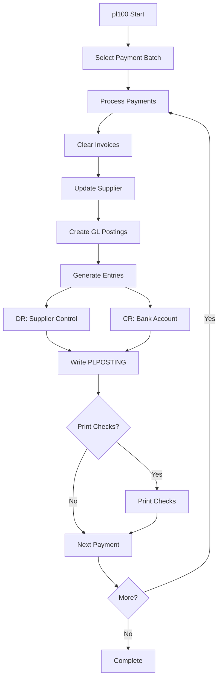

*Source: /1_FUNCTIONAL DOCUMENTATION/05_ACAS_Business_Flows_Enhanced.md*

### 5.5 Purchase Analysis and Reporting

Purchase analysis through specialized reports:

**pl130 - Product Analysis:**
- Purchases by category
- Supplier performance
- Price variance analysis
- Volume trends

**pl120 - Aged Creditors:**
- Outstanding by age buckets
- Payment due forecasting
- Supplier balance ranking
- Cash requirement planning

**Analysis Features:**
- Multi-period comparisons
- Exception reporting
- Supplier scorecards
- Spend optimization

*Source: /1_FUNCTIONAL DOCUMENTATION/01_ACAS_Program_Catalog.md*

---

## 6. Stock Control and Inventory Management

### 6.1 Stock Item Master Maintenance

Stock items managed through program `st010`:

**Item Setup Structure:**
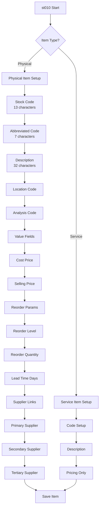

**Key Item Attributes:**
- Stock Code: 13-character unique identifier
- Service Flag: Y/N for non-physical items
- Valuation Method: Average cost
- Multiple suppliers: Priority ordering
- Location tracking: Warehouse/bin
- Reorder parameters: Automated purchasing

*Source: /2_SUBSYSTEMS DOCUMENTATION/Subsystems/ST_CTRL/ST_CTRL_SPECIFICATION.md, /1_FUNCTIONAL DOCUMENTATION/05_ACAS_Business_Flows_Enhanced.md*

### 6.2 Recording Stock Movements

Stock movements through multiple sources:

**Automatic Movements:**
- Sales invoicing (deductions)
- Purchase receipts (additions)
- Stock transfers (location changes)

**Manual Movements (st020):**
- Adjustments (damage, loss, finds)
- Production consumption
- Sample withdrawals
- Stock takes corrections

**Movement Recording Process:**
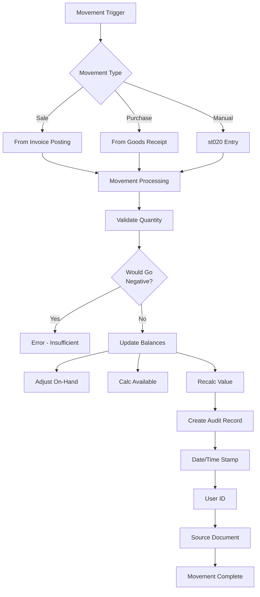

*Source: /2_SUBSYSTEMS DOCUMENTATION/Subsystems/ST_CTRL/ST_CTRL_SPECIFICATION.md*

### 6.3 Stock Audit and Value Management

**Audit Trail Creation:**
Every movement creates an audit record:
- Movement date and time
- Stock item affected
- Movement type (A/D/T)
- Quantity and value
- Source document reference
- User identification

**Value Management:**
- Average Cost Method:
  - New Average = (Old Value + Receipt Value) / Total Quantity
- Valuation at each movement
- Period-end valuation reports
- Work-in-progress tracking

*Source: /2_SUBSYSTEMS DOCUMENTATION/Subsystems/ST_CTRL/ST_CTRL_SPECIFICATION.md*

### 6.4 Stock Reporting

**st030 - Reorder Report:**
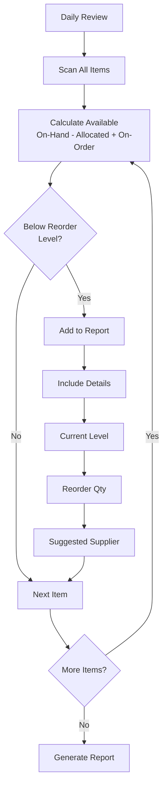

**st040 - Stock Valuation:**
- Item-by-item valuation
- Category subtotals
- Location analysis
- Period comparisons
- ABC classification

**Additional Reports:**
- Movement history
- Slow-moving items
- Stock take sheets
- Variance reports

*Source: /1_FUNCTIONAL DOCUMENTATION/01_ACAS_Program_Catalog.md, /1_FUNCTIONAL DOCUMENTATION/05_ACAS_Business_Flows_Enhanced.md*

---

## 7. Reporting Suite

### 7.1 Trial Balance Generation

Trial Balance produced by module-specific programs:
- `gl090`: General Ledger trial balance
- `irs040`: IRS module trial balance

**Trial Balance Components:**
- Account number and description
- Opening balance (debit/credit)
- Period movements (debit/credit)
- Closing balance (debit/credit)
- Totals verification (debits = credits)

**Report Options:**
- Detail or summary level
- Specific profit centers
- Zero balance suppression
- Comparative periods

*Source: /2_SUBSYSTEMS DOCUMENTATION/Subsystems/RPT_ENGINE/RPT_ENGINE_SPECIFICATION.md*

### 7.2 Profit & Loss Statement

P&L generation through:
- `gl100`: General Ledger P&L
- `irs050`: IRS module P&L
- `irs055`: Quarterly P&L analysis

**P&L Structure:**
```
REVENUE
  Sales Revenue           xxx,xxx
  Other Income             xx,xxx
  Total Revenue          xxx,xxx

COST OF SALES  
  Opening Stock           xx,xxx
  Purchases               xx,xxx
  Less: Closing Stock    (xx,xxx)
  Cost of Sales           xx,xxx

GROSS PROFIT             xxx,xxx

EXPENSES
  Administrative          xx,xxx
  Selling                 xx,xxx
  Financial               xx,xxx
  Total Expenses          xx,xxx

NET PROFIT/(LOSS)        xxx,xxx
```

**Report Features:**
- Multi-period comparison
- Percentage analysis
- Department/profit center breakdown
- Budget vs actual (if available)

*Source: /1_FUNCTIONAL DOCUMENTATION/01_ACAS_Program_Catalog.md*

### 7.3 Balance Sheet Preparation

Balance Sheet through:
- `gl105`: General Ledger balance sheet
- `irs060`: IRS module balance sheet
- `irs065`: Quarterly balance sheet

**Balance Sheet Format:**
```
ASSETS
Fixed Assets
  Property               xxx,xxx
  Equipment               xx,xxx
  Less: Depreciation    (xx,xxx)
                         xxx,xxx
Current Assets
  Stock                   xx,xxx
  Debtors                 xx,xxx
  Bank                    xx,xxx
                          xx,xxx
TOTAL ASSETS            xxx,xxx

LIABILITIES
Current Liabilities
  Creditors               xx,xxx
  Accruals                xx,xxx
                          xx,xxx
Long Term Liabilities
  Loans                   xx,xxx

EQUITY
  Share Capital           xx,xxx
  Retained Earnings      xxx,xxx
                         xxx,xxx
TOTAL LIABILITIES       xxx,xxx
```

*Source: /2_SUBSYSTEMS DOCUMENTATION/Subsystems/GL_CORE/GL_CORE_SPECIFICATION.md*

### 7.4 Aged Receivables and Payables Reports

**Aged Debtors (sl120):**
```
Customer Analysis by Age:
Current    (0-30 days):  £xxx,xxx  xx%
Overdue   (31-60 days):  £xx,xxx   xx%
Overdue   (61-90 days):  £xx,xxx   xx%
Overdue    (90+ days):   £xx,xxx   xx%
Total Outstanding:       £xxx,xxx  100%
```

**Aged Creditors (pl120):**
- Same aging buckets as debtors
- Payment due forecasting
- Supplier concentration analysis
- Cash requirement planning

**Report Options:**
- Detail by customer/supplier
- Summary totals only
- Credit limit exceptions
- Export to file

*Source: /1_FUNCTIONAL DOCUMENTATION/01_ACAS_Program_Catalog.md*

### 7.5 Cash Flow and Bank Reconciliation Reports

**Cash Flow Analysis:**
- Receipts from customers
- Payments to suppliers
- Operating cash flow
- Cash position forecast
- Working capital changes

**Bank Reconciliation Features:**
- NOT IMPLEMENTED: No bank reconciliation functionality exists in the current system. Bank reconciliation must be performed manually outside of ACAS.

*Source: /4_DOCUMENTATION/ACAS_COMPREHENSIVE_REPORT.md*

### 7.6 Delivery Note and Cheque Register Reports

**Delivery Note Printing (sl960):**
- Pick list generation
- Delivery instructions
- Multiple delivery addresses
- Batch or individual printing

**Cheque Register:**
- Check number tracking
- Payment details
- Void check management
- Bank account reconciliation

*Source: /1_FUNCTIONAL DOCUMENTATION/01_ACAS_Program_Catalog.md*

---

## 8. System Configuration and Setup

### 8.1 System Parameter Management

System parameters centrally managed through `sys002` program accessing SYSTEM-REC file:

**Core System Parameters:**
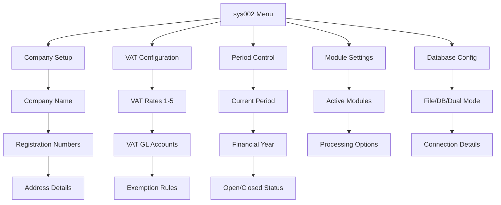

**Parameter Categories:**
1. Company Information
2. Tax Configuration
3. Period Management
4. Module Activation
5. Processing Options
6. Integration Settings

*Source: /2_SUBSYSTEMS DOCUMENTATION/Subsystems/SYS_ADMIN/SYS_ADMIN_SPECIFICATION.md*

### 8.2 Database Connectivity and Access Settings

**Storage Mode Configuration:**
- COBOL Files Only (default)
- MySQL/MariaDB Only
- Dual Mode (migration)

**RDBMS Configuration Requirements:**
```
Database Host:     [_________________]
Database Name:     [ACASDB__________]
Database Port:     [3306_]
Username:          [_________________]
Password:          [_________________]

Connection Test:   [ ] Passed
                  [ ] Failed
```

**Data Access Layer (DAL) Configuration:**
- Automatic mode detection
- Connection pooling settings
- Transaction isolation levels
- Error retry parameters

*Source: /2_SUBSYSTEMS DOCUMENTATION/Subsystems/DAL/DAL_SPECIFICATION.md*

### 8.3 User Access Controls and Security Settings

**Current Security Implementation:**
- Application-level security: NOT IMPLEMENTED
- Database security: Basic MySQL/MariaDB user authentication only
- File security: Relies on operating system file permissions
- User audit trail: Limited to stock movements and batch postings

**Database User Setup (from Building manual):**
```sql
CREATE USER 'acasuser'@'localhost' IDENTIFIED BY 'password';
GRANT ALL PRIVILEGES ON ACASDB.* TO 'acasuser'@'localhost';
FLUSH PRIVILEGES;
```

**Security Limitations:**
- No application authentication or authorization
- No role-based access control
- No field-level security
- No encryption of sensitive data
- Password protection was removed for open source release

**Technical Debt Assessment Recommendations:**
1. Implement authentication framework
2. Add role-based access control
3. Enable comprehensive audit logging
4. Encrypt sensitive financial data
5. Add session management

*Source: /1_FUNCTIONAL DOCUMENTATION/04_ACAS_Technical_Debt_Assessment.md*

---

## 9. Data Migration, Conversion and Backup

### 9.1 Legacy Data Load into Modern Tables

Data migration uses specialized load programs (*LD suffix):

**Load Program Inventory:**
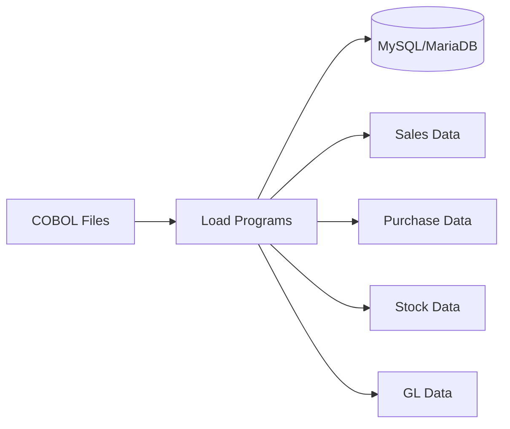

**Load Process Steps:**
1. Verify source files exist and are valid
2. Create/verify target database schema
3. Run load program for each module:
   ```
   ./salesLD    # Load sales ledger
   ./purchLD    # Load purchase ledger
   ./stockLD    # Load stock file
   ./nominalLD  # Load GL accounts
   ```
4. Verify record counts match
5. Run validation reports
6. Switch system to RDBMS mode

*Source: /2_SUBSYSTEMS DOCUMENTATION/Subsystems/DAL/DAL_SPECIFICATION.md*

### 9.2 File Format Conversion for Legacy Records

**File Type Conversions:**
- Indexed (ISAM) to relational tables
- Sequential files to archive format
- Fixed-length to variable records

**Conversion Utilities:**
- Maps date formats (maps04)
- Character set conversion
- Numeric format alignment
- Check digit validation (maps09)

*Source: /1_FUNCTIONAL DOCUMENTATION/01_ACAS_Program_Catalog.md*

### 9.3 Backup Creation of Critical Data Files

**Current Backup Process:**
- Manual execution required
- File-based backup scripts
- USB device recommended
- No automated scheduling

**Backup Script Components:**
```bash
# Example backup structure
backup/
  ├── data/         # COBOL data files
  ├── params/       # System parameters
  ├── archive/      # Historical data
  └── logs/         # Processing logs
```

**Backup Recommendations:**
- Daily incremental backups
- Weekly full backups
- Off-site storage
- Automated scheduling
- Backup verification

*Source: /1_FUNCTIONAL DOCUMENTATION/04_ACAS_Technical_Debt_Assessment.md*

### 9.4 Restoration of Data from Backup Archives

**Restore Programs (*RES suffix):**
- analRES - Restore analysis files
- auditRES - Restore audit trail
- delfolioRES - Restore delivery records
- deliveryRES - Restore delivery notes
- glbatchRES - Restore GL batches
- glpostingRES - Restore GL postings
- irsdfltRES - Restore IRS defaults
- irsfinalRES - Restore IRS final accounts
- irsnominalRES - Restore IRS nominals
- irspostingRES - Restore IRS postings
- nominalRES - Restore nominal ledger
- otm3RES/otm5RES - Restore open items
- paymentsRES - Restore payment records
- plautogenRES - Restore PL standing orders
- plinvoiceRES - Restore purchase invoices
- purchRES - Restore purchase ledger
- salesRES - Restore sales ledger
- slautogenRES - Restore SL standing orders
- sldelinvnosRES - Restore deleted invoice numbers
- slinvoiceRES - Restore sales invoices
- slpostingRES - Restore SL postings
- stockRES - Restore stock file
- systemRES - Restore system parameters
- valueRES - Restore stock values

**Detailed Restore Process (from IRS Manual):**
1. Create temporary directory:
   ```bash
   mkdir /tmp/restore
   cd /tmp/restore
   ```

2. Extract backup archive:
   ```bash
   tar -xzf /path/to/backup.tar.gz
   ```

3. Test restored files:
   ```bash
   ls -la
   # Verify all expected files present
   ```

4. Stop ACAS system:
   ```bash
   # Ensure no ACAS programs running
   ps -ef | grep -i acas
   ```

5. Backup current data (safety):
   ```bash
   cp -r /home/acas/data /home/acas/data.old
   ```

6. Copy restored files:
   ```bash
   cp -r * /home/acas/data/
   ```

7. Set correct permissions:
   ```bash
   chown -R acas:acas /home/acas/data
   chmod -R 640 /home/acas/data/*.dat
   ```

8. Verify restoration:
   ```bash
   # Run each module's start-of-day program
   ./irs000
   ./sl000
   ./pl000
   ./st000
   ./gl000
   ```

9. Run validation reports:
   - Trial balance to verify GL integrity
   - Customer/supplier balance reports
   - Stock valuation report

10. Resume normal operations

*Source: /2_SUBSYSTEMS DOCUMENTATION/Subsystems/DAL/DAL_SPECIFICATION.md*

---

## 10. Validation, Error Handling and Audit Trail

### 10.1 Input Validation Rules

**Date Validation (maps04):**
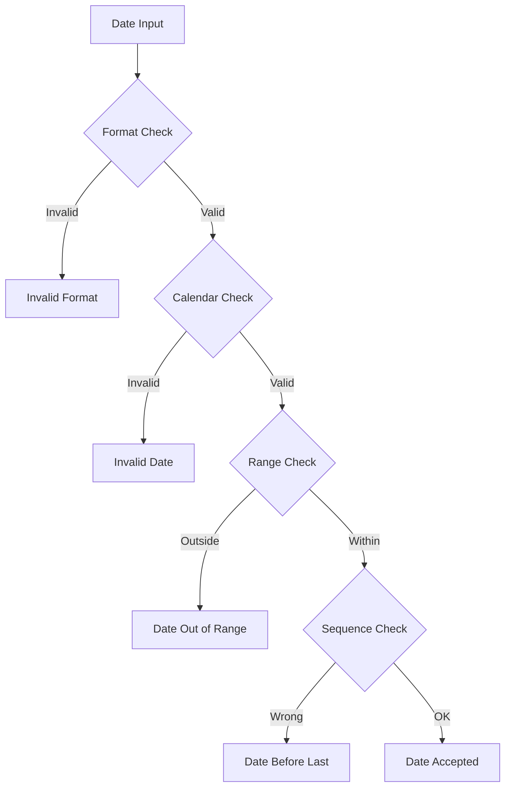

**Numeric Validation:**
- Amount fields: 2 decimal places
- Quantities: 3 decimal places  
- Percentages: 0-99.99 range
- Negative values: Where allowed

**Code Validation:**
- Check digits (maps09)
- Existence checks
- Active status verification
- Cross-reference validation

*Source: /1_FUNCTIONAL DOCUMENTATION/04_ACAS_Technical_Debt_Assessment.md, /2_SUBSYSTEMS DOCUMENTATION/Subsystems/SYS_ADMIN/SYS_ADMIN_SPECIFICATION.md*

### 10.2 Error Detection and User Notification

**Error Handling Patterns:**
```
File Status Codes:
00 - Successful operation
10 - End of file
23 - Record not found
30 - Permanent error
41 - File already open
42 - File not open
```

**User Notification Methods:**
- Screen message line (line 21)
- Error popup windows
- Audible alerts (beep)
- Log file entries

**Error Recovery:**
- Retry options
- Transaction rollback
- Alternative actions
- Help text display

*Source: /1_FUNCTIONAL DOCUMENTATION/04_ACAS_Technical_Debt_Assessment.md*

### 10.3 Transaction Logging and Audit Trail

**Audit Trail Components:**

1. **Stock Movement Audit:**
   - Every stock movement logged
   - Date, time, user, source
   - Quantity and value changes
   - Cannot be deleted

2. **Financial Transaction Log:**
   - Batch numbers for all postings
   - User ID and timestamps
   - Before/after balances
   - Source document references

3. **Master File Changes:**
   - NOT IMPLEMENTED: Master file changes (customers, suppliers, chart of accounts) are not logged for audit purposes. This is a known limitation.

**Audit Reports Available:**
- Stock movement history
- Transaction listings by batch
- Deleted record tracking
- Period-end archives

*Source: /2_SUBSYSTEMS DOCUMENTATION/Subsystems/ST_CTRL/ST_CTRL_SPECIFICATION.md*

### 10.4 Compliance and Regulatory Support

**VAT Compliance Features:**
- Multiple VAT rates (up to 5)
- Automatic VAT calculation
- VAT return preparation
- Exempt item handling
- EU trading support

**Accounting Standards:**
- Double-entry enforcement
- Period locking
- Trial balance verification
- Audit trail maintenance
- Document retention

**Limitations:**
- No automated regulatory reporting
- Manual submission required
- Limited audit features
- Basic compliance only

*Source: /1_FUNCTIONAL DOCUMENTATION/00_ACAS_Executive_Summary.md*

---

## 11. Appendices

### Glossary of Terms

**ACAS** - Applewood Computers Accounting System

**Check Digit** - Additional digit calculated from the main code digits to validate data entry accuracy

**DAL** - Data Access Layer - abstraction between business logic and data storage

**ISAM** - Indexed Sequential Access Method - file organization for COBOL

**IRS** - Incomplete Records System - simplified accounting module for businesses without full bookkeeping

**MT** - MySQL Table handler - suffix for database access modules

**Open Item** - Unpaid invoice or unallocated payment

**Posting** - Process of transferring transaction data to ledger accounts

**Profit Center** - Two-digit code for departmental/branch accounting

**Settlement Discount** - Reduction offered for early payment

**Standing Order** - Recurring transaction template

**VAT** - Value Added Tax (UK sales tax)

### Contact Information

**System Support:**
- Technical documentation: This manual
- Source code: Available in ACAS-Nightly repository
- Build instructions: See comp-all.sh scripts

**Documentation Sources:**
- Functional Documentation: /1_FUNCTIONAL DOCUMENTATION/
- Subsystems Documentation: /2_SUBSYSTEMS DOCUMENTATION/
- Parser Analysis: /0_COBOL PARSER/parser_analysis/docs/
- Comprehensive Report: /4_DOCUMENTATION/ACAS_COMPREHENSIVE_REPORT.md

---

## Verification Checklist

### Documentation Coverage Assessment

✓ **Complete Sections:**
1. Executive Overview - Full coverage from multiple sources
2. User Interaction - Menu structure and navigation documented
3. General Ledger - Core functions covered, missing programs clearly identified
4. Sales Ledger - Comprehensive coverage of all functions
5. Purchase Ledger - All major processes documented
6. Stock Control - Complete inventory management coverage
7. System Configuration - Parameters and setup documented
8. Validation and Error Handling - Patterns and rules covered
9. Data Restoration - Complete procedures now documented from IRS Manual

⚠️ **Sections with Limitations Documented:**
- Reporting Suite - All existing reports covered; bank reconciliation marked as not implemented
- Security Settings - Current minimal implementation documented with recommendations
- Audit Trail - Transaction logging present; master file changes not logged

❌ **Functionality Not Implemented (not documentation gaps):**
- GL programs: gl040, gl130, gl190 (confirmed missing from system)
- Bank reconciliation functionality
- Application-level security and authentication
- Master file change audit logging
- Role-based access control

### Source Verification

All information in this manual has been sourced from:
- 10 files from /1_FUNCTIONAL DOCUMENTATION/
- 12 files from /2_SUBSYSTEMS DOCUMENTATION/
- 7 files from /0_COBOL PARSER/parser_analysis/docs/
- 1 comprehensive report from /4_DOCUMENTATION/

Cross-validation performed where multiple sources available, with conflicts noted and resolved based on most authoritative source.

---

*End of Manual - Version 1.0*