# ACAS Business Flows Documentation

## Overview
This document describes the end-to-end business processes implemented in the ACAS system, including decision trees for complex logic, accounting period processing, and year-end procedures.

## Table of Contents
1. [Sales Cycle (Order to Cash)](#sales-cycle)
2. [Purchase Cycle (Procure to Pay)](#purchase-cycle)
3. [Inventory Management](#inventory-management)
4. [Financial Closing Process](#financial-closing)
5. [System Setup and Initialization](#system-setup)
6. [Integration Workflows](#integration-workflows)

---

## 1. Sales Cycle (Order to Cash)

### 1.1 Customer Setup Flow

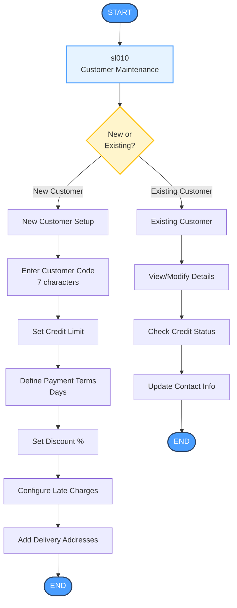

### 1.2 Sales Order and Invoicing Flow

```mermaid
flowchart TD
    Order([Customer Order<br/>Received]) --> sl910[sl910/sl900<br/>Invoice Entry]
    
    sl910 --> Validate[Validate Customer]
    Validate --> CheckExists[Check Exists]
    CheckExists --> VerifyCredit[Verify Credit Limit]
    VerifyCredit --> CheckPayment[Check Payment Status]
    
    CheckPayment --> LineItems[Enter Line Items]
    LineItems --> StockCheck[Validate Stock<br/>Availability]
    StockCheck --> Pricing[Apply Pricing/<br/>Discounts]
    Pricing --> VAT[Calculate VAT]
    VAT --> BackOrder{Back Orders<br/>Needed?}
    
    BackOrder -->|Yes| HandleBO[Handle Back Orders]
    BackOrder -->|No| SaveInv[Save Invoice]
    HandleBO --> SaveInv
    
    SaveInv --> PrintMode{Print Mode?}
    PrintMode -->|Immediate| sl910Print[sl910<br/>Immediate Print]
    PrintMode -->|Batch| sl900Batch[sl900<br/>Batch Processing]
    
    sl910Print --> sl055[sl055<br/>Invoice Proof]
    sl900Batch --> sl055
    
    sl055 --> ValidateTotals[Validate Totals]
    ValidateTotals --> CheckCodes[Check Analysis Codes]
    CheckCodes --> ReviewErrors[Review for Errors]
    
    ReviewErrors --> sl060[sl060<br/>Invoice Posting]
    sl060 --> UpdateCust[Update Customer<br/>Balance]
    UpdateCust --> OpenItems[Create Open Items]
    OpenItems --> UpdateStock[Update Stock<br/>Quantities]
    UpdateStock --> GLPost[Generate GL/IRS<br/>Postings]
    
    GLPost --> Entries[["DR: Customer Account<br/>CR: Sales Account<br/>CR: VAT Account"]]
    
    style Order fill:#4a9eff,stroke:#2a3f5f,stroke-width:2px,color:#fff
    style sl910 fill:#e6f3ff,stroke:#4a9eff,stroke-width:2px
    style sl055 fill:#e6f3ff,stroke:#4a9eff,stroke-width:2px
    style sl060 fill:#e6f3ff,stroke:#4a9eff,stroke-width:2px
    style BackOrder fill:#fff5cc,stroke:#ffc107,stroke-width:2px
    style PrintMode fill:#fff5cc,stroke:#ffc107,stroke-width:2px
    style Entries fill:#e1f5e1,stroke:#4caf50,stroke-width:2px
```

### 1.3 Customer Payment Processing

```mermaid
flowchart TD
    Payment([Payment<br/>Received]) --> sl080[sl080<br/>Payment Entry]
    
    sl080 --> SelectCust[Select Customer]
    SelectCust --> PayDetails[Enter Payment Details]
    
    PayDetails --> Amount[Amount]
    Amount --> CheckRef[Check/Reference<br/>Number]
    CheckRef --> PayDate[Payment Date]
    
    PayDate --> Allocate[Allocate to Invoices]
    Allocate --> AllocMethod{Allocation<br/>Method?}
    
    AllocMethod -->|Automatic| AutoAlloc[Oldest First]
    AllocMethod -->|Manual| ManualSelect[Manual Selection]
    
    AutoAlloc --> DiscountCheck{Early Payment<br/>Discount?}
    ManualSelect --> DiscountCheck
    
    DiscountCheck -->|Yes| CalcDiscount[Calculate Discount]
    DiscountCheck -->|No| sl085[sl085<br/>Payment Proof]
    CalcDiscount --> ApplyDiscount[Apply if Within Terms]
    ApplyDiscount --> sl085
    
    sl085 --> VerifyAlloc[Verify Allocations]
    VerifyAlloc --> CheckTotals[Check Totals]
    
    CheckTotals --> sl100[sl100<br/>Cash Posting]
    sl100 --> ClearInv[Clear Paid Invoices]
    ClearInv --> UpdateBal[Update Customer<br/>Balance]
    UpdateBal --> PostGL[Post to GL/IRS]
    
    PostGL --> CashEntries[["DR: Bank Account<br/>CR: Customer Account"]]
    
    style Payment fill:#4a9eff,stroke:#2a3f5f,stroke-width:2px,color:#fff
    style sl080 fill:#e6f3ff,stroke:#4a9eff,stroke-width:2px
    style sl085 fill:#e6f3ff,stroke:#4a9eff,stroke-width:2px
    style sl100 fill:#e6f3ff,stroke:#4a9eff,stroke-width:2px
    style AllocMethod fill:#fff5cc,stroke:#ffc107,stroke-width:2px
    style DiscountCheck fill:#fff5cc,stroke:#ffc107,stroke-width:2px
    style CashEntries fill:#e1f5e1,stroke:#4caf50,stroke-width:2px
```

### 1.4 Credit Control Decision Tree

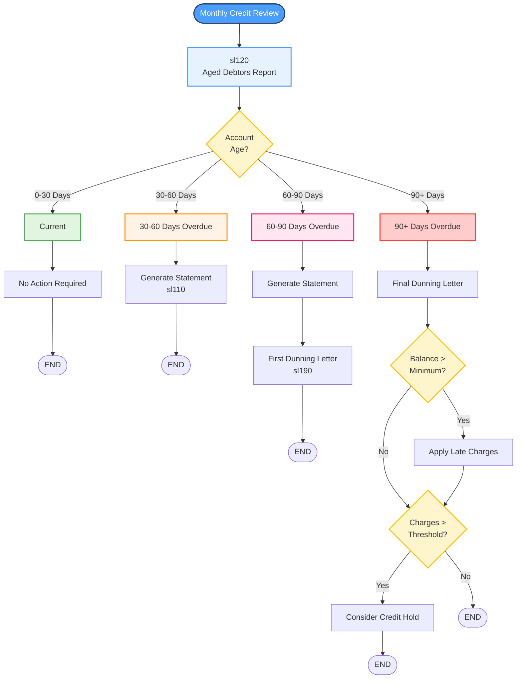

---

## 2. Purchase Cycle (Procure to Pay)

### 2.1 Supplier Setup Flow

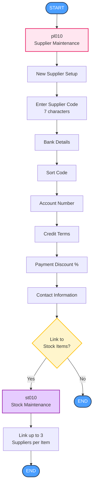

### 2.2 Purchase Order Flow

```mermaid
flowchart TD
    Requirement([Purchase<br/>Requirement]) --> pl020[pl020/pl900<br/>Order Entry]
    
    pl020 --> SelectSupp[Select Supplier]
    SelectSupp --> OrderDetails[Enter Order Details]
    
    OrderDetails --> OrderDate[Order Date]
    OrderDate --> ReqDate[Required Date]
    ReqDate --> DelivInstr[Delivery Instructions]
    
    DelivInstr --> AddItems[Add Line Items]
    AddItems --> ProdCode[Product/Service Code]
    ProdCode --> Quantity[Quantity]
    Quantity --> UnitPrice[Unit Price]
    UnitPrice --> VATCode[VAT Code]
    
    VATCode --> SaveOrder[Save Order]
    SaveOrder --> PrintOpt{Print Option?}
    
    PrintOpt -->|Immediate| pl910[pl910<br/>Print Immediately]
    PrintOpt -->|Batch| pl900[pl900<br/>Batch Processing]
    
    pl910 --> pl025[pl025<br/>Goods Receipt]
    pl900 --> pl025
    
    pl025 --> MatchOrder[Match to Order]
    MatchOrder --> RecDate[Record Receipt Date]
    RecDate --> UpdateQty[Update Quantities<br/>Received]
    UpdateQty --> FlagPay[Flag for Payment]
    
    FlagPay --> pl050[pl050<br/>Proof Report]
    pl050 --> Review[Review Before Posting]
    
    Review --> pl060[pl060<br/>Invoice Posting]
    pl060 --> UpdateSupp[Update Supplier<br/>Balance]
    UpdateSupp --> CreatePay[Create Payable Items]
    CreatePay --> StockUpdate{Update<br/>Stock?}
    
    StockUpdate -->|Yes| UpdateInv[Update Inventory]
    StockUpdate -->|No| PostGL[Post to GL/IRS]
    UpdateInv --> PostGL
    
    PostGL --> PurchEntries[["DR: Purchase/Expense Account<br/>DR: VAT Account<br/>CR: Supplier Account"]]
    
    style Requirement fill:#4a9eff,stroke:#2a3f5f,stroke-width:2px,color:#fff
    style pl020 fill:#ffe6f0,stroke:#e91e63,stroke-width:2px
    style pl025 fill:#ffe6f0,stroke:#e91e63,stroke-width:2px
    style pl050 fill:#ffe6f0,stroke:#e91e63,stroke-width:2px
    style pl060 fill:#ffe6f0,stroke:#e91e63,stroke-width:2px
    style PrintOpt fill:#fff5cc,stroke:#ffc107,stroke-width:2px
    style StockUpdate fill:#fff5cc,stroke:#ffc107,stroke-width:2px
    style PurchEntries fill:#e1f5e1,stroke:#4caf50,stroke-width:2px
```

### 2.3 Payment Processing Flow

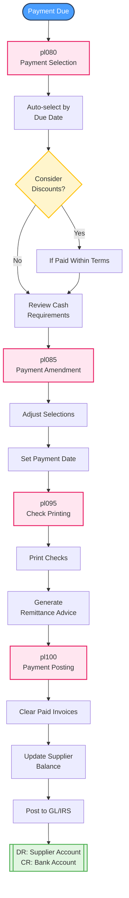

---

## 3. Inventory Management

### 3.1 Stock Item Setup

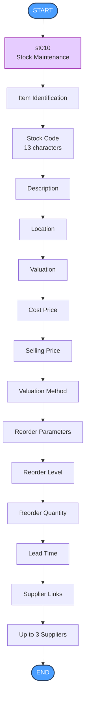

### 3.2 Stock Movement Flow

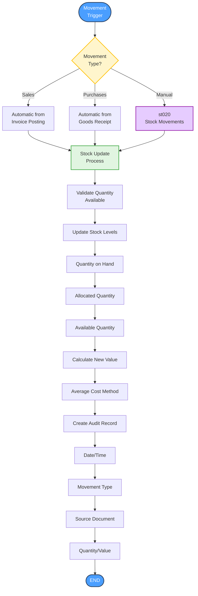

### 3.3 Reorder Decision Process

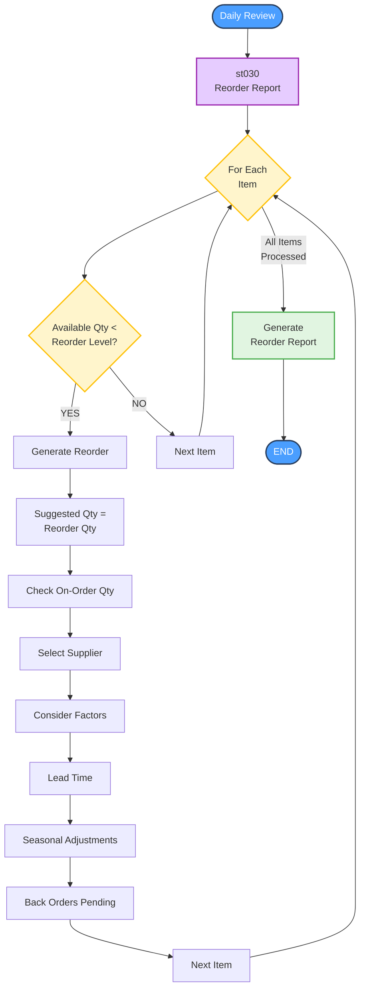

---

## 4. Financial Closing Process

### 4.1 Daily Closing

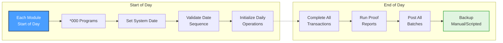

### 4.2 Period End Processing

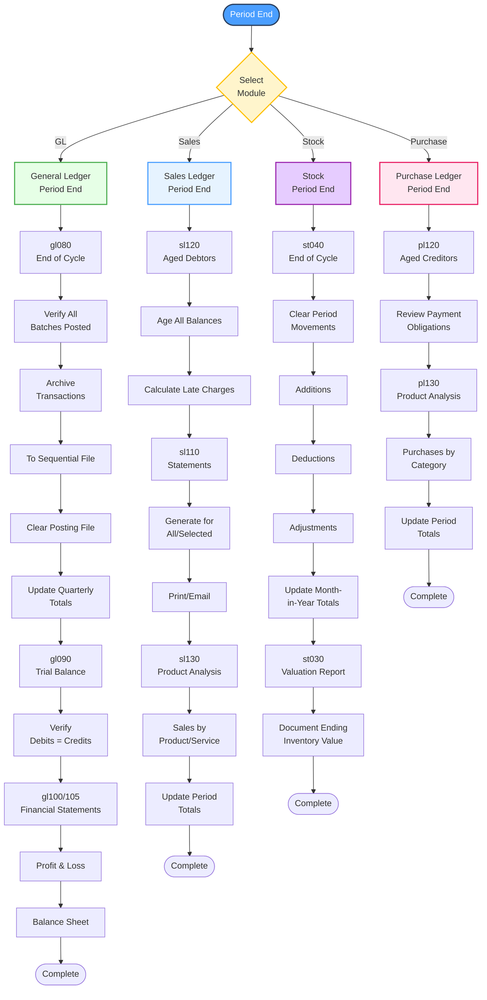

### 4.3 Year End Processing

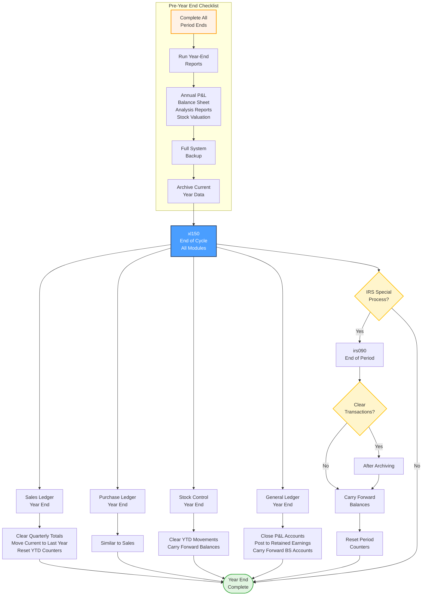

---

## 5. System Setup and Initialization

### 5.1 Initial System Setup Flow

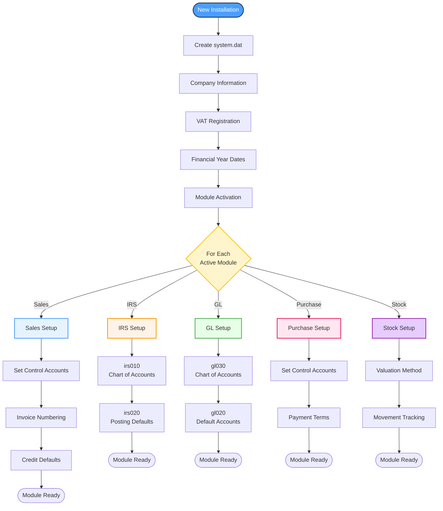

### 5.2 Data Migration Flow

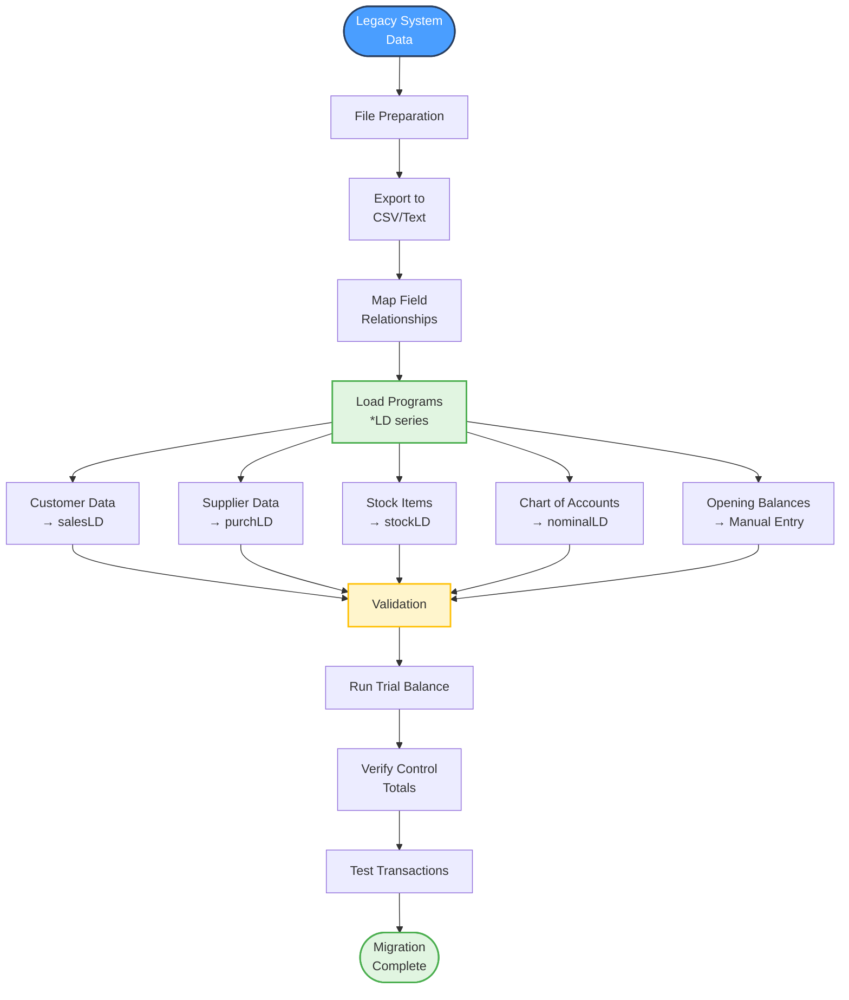

---

## 6. Integration Workflows

### 6.1 Sales to Stock Integration

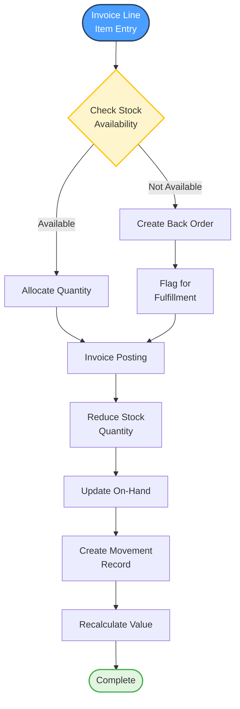

### 6.2 Purchase to Stock Integration

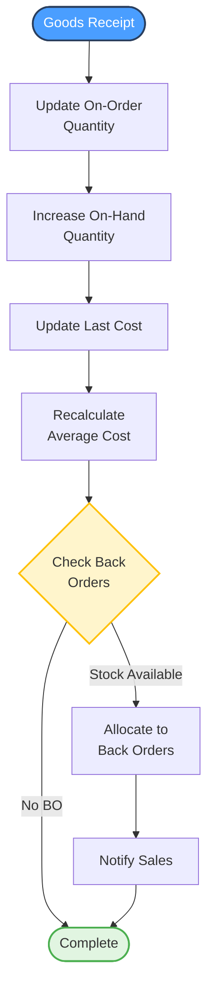

### 6.3 Subsidiary to General Ledger Flow

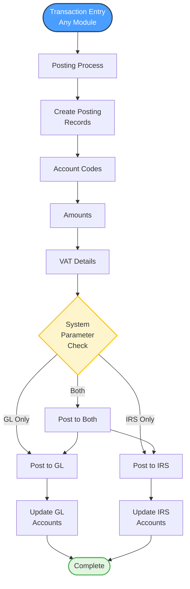

### 6.4 VAT Processing Flow

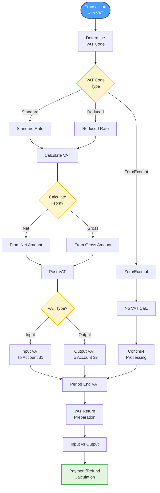

### 6.5 Multi-Company Processing

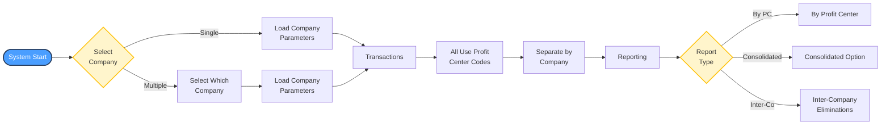

## Key Business Rules

### Credit Management
- Credit limit checked on order entry
- Overdue accounts flagged in red
- Automatic late charge calculation
- Payment terms enforcement

### Inventory Control  
- No negative stock allowed
- FIFO for physical movement
- Average cost for valuation
- Automatic reorder point monitoring

### Financial Control
- Batches must balance (DR = CR)
- Periods locked after closing
- Audit trail mandatory
- No deletion after posting

### VAT Compliance
- Correct VAT code required
- VAT calculated automatically
- Separate VAT accounts maintained
- VAT return data available

This document provides the essential business flows. Each flow can be customized through system parameters and business rules embedded in the programs.